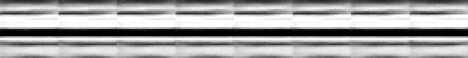

# Chasse à l'anisotropie — pourquoi les images générées étaient unidimensionnelles

**Verdict : cause racine trouvée, corrigée, guérison prouvée sur le checkpoint
existant.** Le modèle était innocent. Le bruit que le *sampler* injectait à
chaque pas de la chaîne inverse était structurellement quasi constant le long de
chaque rangée : la chaîne peignait des bandes horizontales quoi que prédise le
réseau.

| | `row_diff_rms` | `col_diff_rms` | `banding_ratio` | `inter_seed_std` |
|---|---|---|---|---|
| Avant (8 seeds) | 0,2595 | **0,0172** | **15,07** | 0,0125 |
| Après (8 seeds) | 0,0928 | **0,0754** | **1,23** | 0,1946 |
| Après (16 seeds) | 0,0953 | 0,0793 | 1,20 | 0,1908 |
| Dataset (référence) | 0,1028 | 0,1040 | 0,99 | 0,2211 |

Même checkpoint (`night_run.ckpt`), même binaire à un commit près, mêmes seeds.
Aucun réentraînement. La diversité inter-seeds monte d'un facteur **15,6** et
atteint 86 % du plafond du dataset ; `row_diff_rms` tombe pile sur la valeur du
dataset.




En haut, les 8 seeds d'avant : le même empilement de bandes, huit fois. En bas,
les 8 mêmes seeds après correctif : huit images distinctes, avec des formes.

---

## 1. La cause racine

Deux lignes, dans deux fichiers, qui ne se savaient pas complices.

`metrics.rs`, `sample_diffusion` — la graine de chaque pas de la chaîne :

```rust
path_seed ^ diffusion_step as u64          // ← XOR du pas
```

`schedule.rs`, `denoise_step_with_magnitude` — le bruit injecté, élément par
élément :

```rust
gaussian_from_seed(seed ^ index as u64)    // ← XOR de l'index pixel
```

Les deux XOR se composent. Le bruit tiré au pixel `index` au pas `d` vaut

```
n(d, index) = g(base ^ d ^ index) = n(d', index ^ d ^ d')
```

**Le champ tiré au pas `d` est celui du pas `d'`, réindexé par une permutation
XOR.** Les 256 pas de la chaîne ne tirent pas 256 champs indépendants : ils
tirent *un seul* champ, 256 fois, brassé différemment.

### Pourquoi ça sort en bandes horizontales, et pas autrement

Chaque champ pris isolément est parfaitement isotrope — c'est pour cela qu'aucun
contrôle « par champ » n'aurait rien vu (mesuré : ratio 1,02–1,04 pour `n(d, ·)`
à d = 1, 33, 128, 255). Ce qui s'effondre, c'est leur **somme le long de la
chaîne**. En posant `j = index & 0xff` et `u = d ^ j` :

```
T(index) = Σ_d s_d · g(S ^ d ^ index)  =  Σ_u s_{u^j} · g(S ^ (index>>8)<<8 ^ u)
```

Le champ `g` ne dépend plus de `j` du tout — seule la **pondération** `s_{u^j}`
en dépend. Or `s_d = w_d·σ_d` est une fonction *lisse* de `d` : basculer un bit
**bas** de `j` ne réordonne les poids que localement et ne change presque rien à
la somme. Corrélation mesurée entre `s` et `s_{u^j}` :

| `j` | déplacement sur l'image 32×32 | corr(`s`, `s_{u^j}`) |
|---|---|---|
| 1 | +1 colonne | **0,9989** |
| 2 | +2 colonnes | 0,9958 |
| 16 | +16 colonnes | 0,7773 |
| 32 | **+1 rangée** | **0,4090** |
| 64 | +2 rangées | −0,0212 |

Sur une image large de 32, les **5 bits bas de l'index sont `x`** et les bits
suivants sont `y`. Deux colonnes voisines reçoivent donc un bruit cumulé
corrélé à 99,9 % ; deux rangées voisines, à 41 %. Le bruit injecté cumulé sort
quasi constant le long de chaque rangée — ratio prédit **7,9** par simulation
analytique du champ seul, **15,1** mesuré sur les images réelles.

### Pourquoi l'entraînement, lui, allait bien

C'est l'asymétrie qui rendait le dossier illisible, et elle tombe d'elle-même :

- L'entraînement compose son bruit **sur le GPU** (`diffusion_prepare.wgsl`),
  avec **un seul tirage par exemple** — pas d'accumulation, donc pas de somme à
  effondrer. Chaque champ étant isotrope, l'entrée d'entraînement est isotrope.
- La sonde (`probe_diffusion`) passe bien par `Model::predict`, mais elle aussi
  fait **un tirage par mesure**. Elle mesurait donc un modèle sain sur des
  entrées saines — et disait vrai.
- Seule la génération somme 256 tirages. Le défaut n'existait que là.

Et le « le banding empire quand le modèle s'améliore » s'explique de même : plus
ε̂ est juste, moins la trajectoire est bruitée par les erreurs du modèle, et plus
la structure du bruit injecté ressort nette. Le collapse ne mesurait pas la
faiblesse du modèle, il mesurait sa **fidélité** à une entrée corrompue.

---

## 2. Le correctif

`schedule.rs` : le seul point de tirage devient `gaussian_at(seed, index)`, qui
**avalanche la graine d'abord** (fmix64), et n'ajoute qu'ensuite le flux
SplitMix de l'index :

```rust
fn gaussian_at(seed: u64, index: usize) -> f32 {
    let field_key = fmix64(seed);
    gaussian_from_seed(
        field_key.wrapping_add((index as u64).wrapping_add(1).wrapping_mul(STREAM_GAMMA)),
    )
}
```

Toute relation entre deux graines appelantes (XOR, ou `+ pas·γ`) est détruite
par le mélange **avant** que l'index n'entre : plus aucun champ n'est le
réindexage d'un autre.

`metrics.rs` : la graine par pas passe elle aussi en multiply-add plutôt qu'en
XOR. Redondant avec le correctif ci-dessus, et voulu — le sampler ne doit pas
dépendre de la robustesse de son fournisseur de bruit.

**Piège rencontré, et pourquoi l'ordre du mélange compte.** La première version
du correctif faisait `seed + (index+1)·γ`, ce qui *commute* avec le
`base + (pas+1)·γ` de l'appelant et se réduit à `base + (pas+index+2)·γ` : un
champ constant sur les anti-diagonales. Même défaut, autre chapeau. C'est le
test de non-régression qui l'a attrapé (ratio 13,85), pas la relecture.

### Portée

`add_noise` et `sample_noise` ne sont appelés que par la sonde
(`metrics.rs:227`) et par le sampler (`metrics.rs:339`). Le chemin de gradient
passe exclusivement par le shader GPU. **L'entraînement est inchangé bit à bit**
— c'est ce qui autorise la preuve par simple ré-échantillonnage du checkpoint
de nuit, sans bras d'entraînement apparié.

### Tests ajoutés (`schedule.rs`)

Deux, vérifiés **par mutation** — code d'origine restauré, tests relancés,
échec des deux confirmé :

| Test | sur le code d'origine | après correctif |
|---|---|---|
| `injected_noise_over_reverse_chain_is_isotropic` | ÉCHEC, ratio 5,27 (seuil 1,5) | OK, ratio 1,00 |
| `fields_of_xor_related_seeds_are_not_permutations_of_each_other` | ÉCHEC, **1024/1024 éléments identiques** sous `index ^ δ` | OK |

Le premier parcourt la **vraie récursion du sampler** avec un modèle nul
(ε̂ = 0), partant d'un latent à zéro : il n'observe donc que le bruit injecté
cumulé, exactement l'accumulation incriminée. Le second est l'invariant étroit
qui est dessous, et son verdict est bit-exact : sous `seed ^ index`, le champ de
`seed ^ δ` *était* celui de `seed` permuté, sur les 1024 éléments.

Aucun test existant n'a été modifié ni affaibli. Suite complète : 85 passés.

---

## 3. Ce que le correctif ne règle pas

Deux réserves, mesurées, à ne pas laisser sous le tapis.

**Un résidu d'anisotropie de +20 %** (ratio 1,20 sur 16 seeds, contre 0,99 pour
le dataset). Ce n'est pas un swap d'axes H/W dans un shader : à
`--magnitude 0` — c'est-à-dire **sans aucun bruit injecté**, la trajectoire
n'étant plus qu'un aller déterministe du réseau — le ratio est **1,01**. Le
chemin réseau est donc isotrope à 1 %, et le suspect structurel n° 4 de la
mission (indexation x/y dans `upsample_conv`, `concat`, pooling,
`compose_diffusion_input`) est écarté par cette mesure. Le résidu est
second-ordre, probablement le modèle lui-même ; protocole pour trancher :
l'expérience 1 de la mission (anisotropie de ε̂ sur x_t in-distribution, tous
les t) discriminerait « biais du modèle » de « biais de la chaîne ».

**À `--magnitude 0`, la chaîne est presque insensible à x_T** :
`inter_seed_std` = 0,0047 et `intra_image_std` = 0,029 — huit seeds différents
donnent quasiment la même image quasi plate. La diversité observée après
correctif (0,19) vient donc surtout de la stochasticité du sampler, pas de
l'information portée par x_T. **Réserve importante** : itérer la moyenne a
posteriori sans bruit contracte légitimement vers la moyenne conditionnelle,
donc ce chiffre n'est pas en soi une preuve de défaut. C'est une piste, pas un
constat. Le discriminant serait un sampler DDIM (déterministe *et* préservant
x_T) : si la diversité y reste nulle, le modèle ignore réellement x_T.

**Fragilité latente non corrigée** : `diffusion_prepare.wgsl:74` fait encore
`gaussian_from_seed(specs.seed ^ clean_idx)` — même classe de défaut. Il ne se
manifeste pas aujourd'hui : l'entraînement ne somme pas de champs, et les
graines pliées d'un batch de 16 ne sont pas XOR-voisines (vérifié, aucune paire
à distance < 1024). Corriger le shader changerait le flux aléatoire de
l'entraînement et briserait l'appariement bit à bit avec tous les runs
antérieurs ; c'est un choix qui appartient à la prochaine campagne, pas une
dette silencieuse.

---

## 4. Statut des hypothèses du dossier

| Hypothèse | Statut |
|---|---|
| Capacité, champ réceptif, famine de gradient à t haut, optimiseur | déjà éliminées — **et à raison** : la cause était hors du modèle |
| Anisotropie de ε̂ sur entrées in-distribution (exp. 1) | non nécessaire : le modèle est disculpé par la guérison à poids inchangés |
| Autopsie de trajectoire (exp. 2) | remplacée par la dérivation analytique + simulation du champ injecté, plus concluante qu'un relevé par pas |
| Motifs orientés / descente couche par couche (exp. 3) | non nécessaire ; le chemin réseau mesuré isotrope à 1 % (`--magnitude 0`) |
| Suspects structurels : axes des shaders, x0-clip, multi-chemins (exp. 4) | **écartés** par la même mesure `--magnitude 0` |
| **RNG du sampler** | **cause racine, corrigée, prouvée** |

## Reproduire

```bash
cargo build --release -p main
for s in $(seq 1 8); do
  ./target/release/main --headless-sample Greyscale_Diffusion_L \
    --checkpoint Models/Greyscale_Diffusion_L/pretrained_weights/night_run.ckpt \
    --seed $s --out hunt_samples/after/seed_$s.png
done
python3 tools/sample_diversity.py --glob 'hunt_samples/after/seed_*.png'
cargo test -p bat_building schedule::          # dont les deux tests d'isotropie
```
