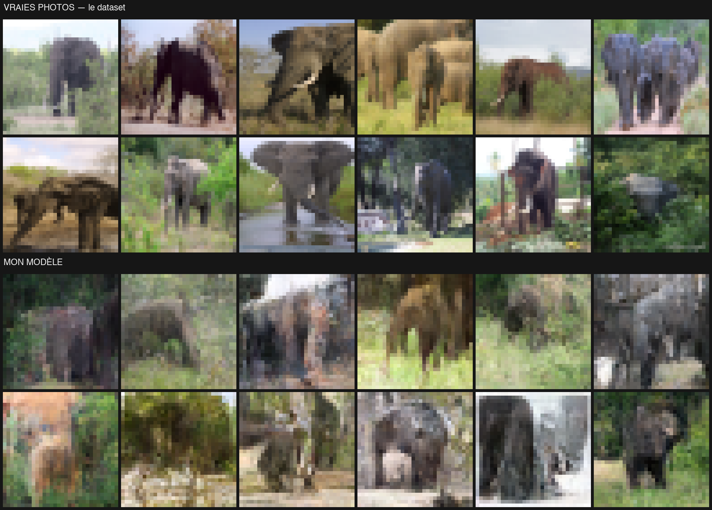

# batLab

Bienvenue sur Batlab, mon framework de machine learning développé en Rust et entièrement portable sur Web !

Ce projet fait suite à mon classifier MNIST développé en C avant d'entamer mon cursus à 42 Paris.

Je souhaitais comprendre comment les modèles génèrent des images tout en gagnant des heures de vol en Rust et en code agentique.

Le résultat est un framework que je développe au fur et à mesure de mes lectures.
Globalement il se compose de la sorte :
-> Un cœur en Rust chargé de construire et d'orchestrer les différentes couches du modèle sur le GPU.
-> Un petit programme par couche du modèle qui s'exécute sur le GPU en WGSL.

L'avantage est que le programme résultant est multiplateforme, et peut s'exécuter directement sur le web !

---

## Le résultat du moment

L'architecture du modèle qui tourne actuellement est tirée du papier [Denoising Diffusion Probabilistic Models](https://arxiv.org/abs/2006.11239).

C'est un U-Net de diffusion de 1,19 M de paramètres, 30× plus petit que celui présenté dans le papier (35,7 M), entraîné sur 1300 photos d'éléphants réduites à 32×32 — pour me permettre de l'entraîner directement sur mon portable.

*En haut, de vraies photos du dataset. En bas, des images générées par le modèle à partir
de pur bruit, sur des graines qu'il n'a jamais vues.*
