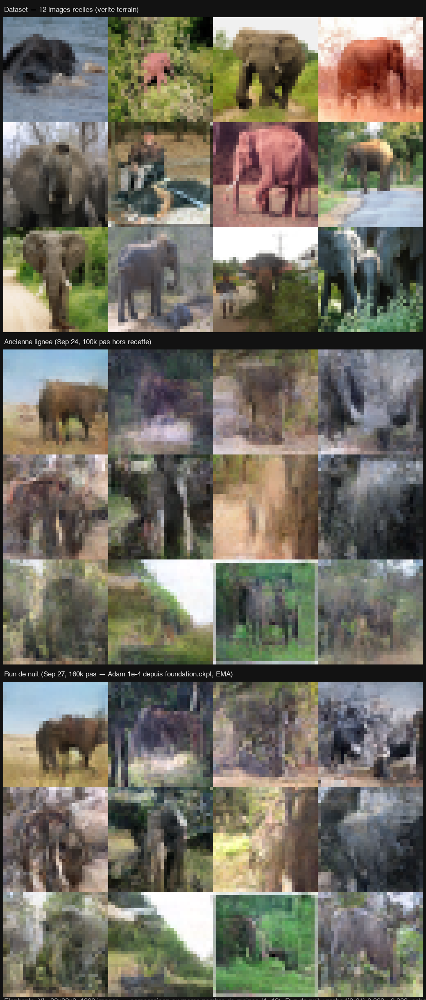

# batLab

Un projet d'apprentissage : **comprendre, en profondeur, comment fonctionne un réseau
U-Net de diffusion** — en l'écrivant from scratch, et en progressant en Rust au passage.

Concrètement : un framework de deep learning écrit **from scratch en Rust**, dont tout le
calcul passe par des **compute shaders WGSL** exécutés sur wgpu. Pas de PyTorch, pas de
LibTorch, pas de crate d'autodiff : les convolutions, la GroupNorm, l'attention,
l'upsample, la loss, SGD et Adam sont des shaders maison, forward *et* backward, et le
graphe est câblé à la main.

Le but n'est pas de rivaliser avec les frameworks existants. C'est que rien ne soit une
boîte noire : chaque rouage a été construit, mesuré, et parfois cassé puis réparé.

---

## Le résultat du moment

Un U-Net de diffusion de **1,19 M de paramètres** (30× plus petit que le DDPM du papier
de Ho et al., 35,7 M), entraîné sur **1300 photos d'éléphants** réduites à 32×32.



*Les trois rangées montrent, aux mêmes graines : de vraies photos du dataset, les échantillons
de l'ancienne lignée (deux fine-tunes trop agressifs, sortis de l'optimum CIFAR), et ceux du
run d'une nuit — 160 000 pas, Adam 1e-4, EMA 0.999, reparti de la fondation CIFAR. Les
échantillons du run de nuit sont à l'échelle in-distribution du dataset : la corrélation avec
la plus proche image réelle (0,584) est statistiquement indistinguable de celle de deux
vraies photos entre elles (0,596 ± 0,12).*

---

## Démarrage rapide

```bash
cargo run --release -p batlab          # le TUI : construire, entraîner, inférer, Perpetual
```

Le TUI est plein écran et interactif ; pour tout usage automatisé (scripts, CI, agents),
les modes **headless** réutilisent la même boucle d'entraînement que la production :

```bash
# entraîner (n'écrase ni le config_file ni les poids sauvegardés)
cargo run --release -p batlab -- --headless-train Elephants_XL \
    --steps 160000 --dataset datasets/elephants_all.batraw \
    --resume Models/Elephants_XL/pretrained_weights/foundation.ckpt \
    --optimizer adam --lr 1e-4 --ema 0.999 --checkpoint-every 1000 \
    --out Models/Elephants_XL/pretrained_weights/run_nuit.ckpt

# échantillonner depuis un checkpoint, sans entraîner
cargo run --release -p batlab -- --headless-sample Elephants_XL \
    --checkpoint Models/Elephants_XL/pretrained_weights/latest.ckpt \
    --seed 7 --magnitude 1.0 --out sample.png

# dérive perpétuelle (re-bruitage sans fin, l'image dérive au lieu de se figer)
cargo run --release -p batlab -- --headless-perpetual Elephants_XL \
    --regime flux --t-star 64 --actions 3000 --seed 7 --dump frames.f32
```

Vérifications :

```bash
cargo test --workspace     # 392 tests (moteur, interface, binaire)
./blind_tests/run.sh       # suite à l'aveugle du régime flux : 9 propriétés
```

---

## Trois planches qui racontent ce qu'on apprend

### Un modèle de diffusion doit savoir *quand* il débruite

À gauche, le réseau ne reçoit pas le timestep `t` : quel que soit le niveau de bruit, il
prédit la même chose, et l'échantillonnage sature en blanc. À droite, le même réseau avec
les canaux d'embedding temporel.


*Détail : [`INSIGHTS_TRAINING.md`](docs/reports/INSIGHTS_TRAINING.md).*

### Le mur de bandes — et le jour où il est tombé

Pendant des semaines, la génération produisait des bandes horizontales alors que
l'entraînement semblait sain. La cause : le sampler XORait le pas dans la graine pendant
que le champ de bruit XORait l'index du pixel — chaque champ isolé était isotrope,
**seule leur somme sur 256 pas s'effondrait**.


*Détail : [`ANISOTROPY_HUNT.md`](docs/reports/ANISOTROPY_HUNT.md).*

### La dérive perpétuelle

Le mode **Perpetual** re-bruite puis re-débruite sans fin : l'image dérive au lieu de se
réinitialiser. C'est le cas d'usage artistique du projet — une vidéo flux qui ne montre
que des éléphants.


*Détail : [`PERPETUAL_INFERENCE.md`](docs/reports/PERPETUAL_INFERENCE.md).*

---

## Architecture

```
crates/
  batlab-core/   le moteur : couches, shaders WGSL, optimiseurs, entraînement, inférence
  batlab-ui/     le TUI ratatui, la fenêtre visualiseur winit, la disposition sur disque
  batlab/        le binaire : CLI, modes headless, orchestration
```

**Pourquoi wgpu.** L'objectif à terme est de faire tourner **l'inférence dans le
navigateur du visiteur, sur sa propre carte graphique** — WebGPU côté client, aucun GPU
serveur. D'où une frontière stricte : `batlab-core` ne dépend ni de ratatui, ni de
crossterm, ni de winit, ne connaît pas le système de fichiers (il prend des octets :
`ModelConfig::from_json_bytes`, `Model::load_checkpoint_bytes`), et la flèche de
dépendance ne pointe que dans un sens : `batlab` → `batlab-ui` → `batlab-core`.

```bash
# la frontière se vérifie en une commande
awk '/^\[dependencies\]/{f=1;next}/^\[/{f=0}f' crates/batlab-core/Cargo.toml \
  | grep -E '^(ratatui|crossterm|winit)' && echo ÉCHEC || echo OK
```

Un vrai build `wasm32` reste une mission à part entière. L'état actuel : la frontière est
propre et le restera.

---

## La méthode : mesurer, ne jamais supposer

Tout ce qui est affirmé ici a été mesuré, pas déduit. Quelques exemples de ce que cette
discipline a donné — chaque ligne a son rapport dans [`docs/reports/`](docs/reports/INDEX.md) :

- **Le gradient était 81 % faux** avant l'audit du pipeline (erreur x₀ vs ε) ; repris à
  moins de 5 %, les pertes par tranche de t ont remplacé la loss batch comme verdict.
- **La convolution la plus lente balayait la carte 256 fois trop d'itérations** — un pas
  d'entraînement est passé de 4400 à 265 ms (16,6×), trajectoire de loss identique.
- **Adam converge ~20× plus vite que SGD** en nombre de pas, surcou < 1 %.
- **L'EMA à 1500 pas est un NO-GO mesuré** (elle déplace la sortie sur 16 seeds sur 16,
  mais deux tiers du déplacement sont un gain de contraste) — utile seulement ≥ 10 000 pas.
- **Pondérer la loss : NO-GO** (le déséquilibre vaut 5,7× en unités ε, pas 1e5).
- **Agrandir le U-Net ne servait à rien** tant que la génération était morte — la capacité
  a été réfutée comme cause du mode collapse.

Et une règle de fabrication : les jalons à invariants comportementaux sont re-testés par
un **agent à l'aveugle** qui écrit ses tests depuis la seule spécification, sans jamais
lire l'implémentation — parce qu'un agent qui a lu le code produit des tests-miroirs qui
codifient le comportement actuel, pas le comportement voulu. Les deux suites coexistent ;
leur désaccord est le signal.

---

## Plateforme

Développé et mesuré sur macOS (Apple Silicon), Rust edition 2024, wgpu 28, ratatui 0.29,
winit 0.30. Rien n'est spécifique à macOS côté moteur ; le visualiseur impose que
l'event loop winit vive sur le thread principal.

La campagne d'ingénierie complète — rapports de mission, planches, index — vit dans
[`docs/reports/`](docs/reports/INDEX.md) et
[`docs/reports/SYNTHESE_CAMPAGNE.md`](docs/reports/SYNTHESE_CAMPAGNE.md).
