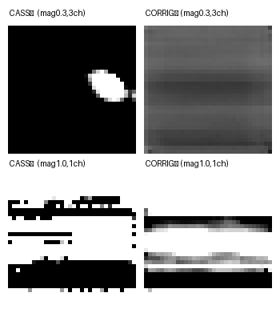
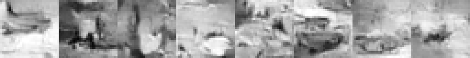
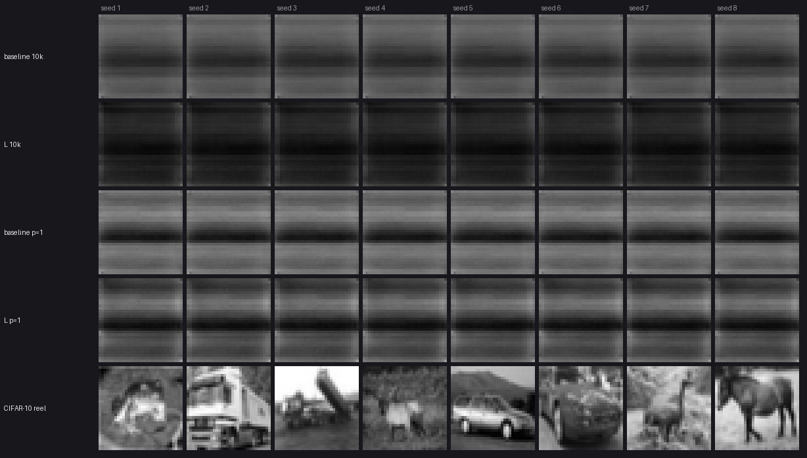
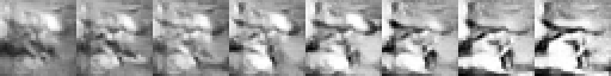
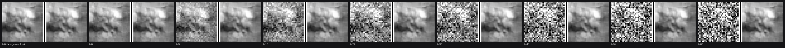
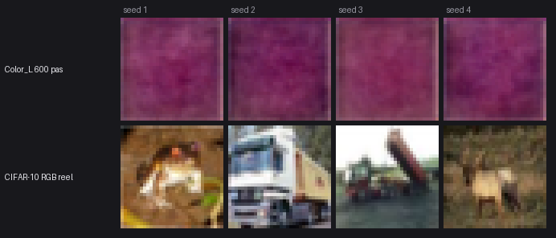

# batLab

Un framework de deep learning écrit **from scratch en Rust**, dont tout le calcul passe
par des **compute shaders WGSL** exécutés sur wgpu. Pas de PyTorch, pas de LibTorch, pas
de crate d'autodiff : les convolutions, la GroupNorm, l'upsample, la loss, SGD et Adam
sont des shaders maison, forward *et* backward, et le graphe est câblé à la main.

L'objet d'étude est un **modèle de diffusion DDPM** entraîné sur CIFAR-10 32×32, piloté
depuis un **TUI ratatui** dans le terminal, avec une fenêtre de visualisation qui lit
directement le buffer GPU de sortie — sans readback CPU.

Ce README montre d'abord les images, parce que c'est là que se lit ce que le code fait
vraiment. La campagne d'ingénierie complète — huit missions, autant de rapports — est
indexée dans [`docs/reports/INDEX.md`](docs/reports/INDEX.md), et racontée en un seul
document dans [`docs/reports/SYNTHESE_CAMPAGNE.md`](docs/reports/SYNTHESE_CAMPAGNE.md).

---

## Les images

### 1. Un modèle de diffusion doit savoir *quand* il débruite

À gauche, le réseau ne reçoit pas le timestep `t` : quel que soit le niveau de bruit, il
prédit la même chose, et l'échantillonnage part en blanc saturé. À droite, le même
réseau avec les canaux d'embedding temporel — il reste très sous-entraîné, mais il
débruite.



*Deux magnitudes de bruit (0,3 et 1,0). Gauche « CASSÉ » : sans `t`. Droite « CORRIGÉ » :
`input_size.z > output.z`, les canaux excédentaires portent l'embedding.
Détail : [`INSIGHTS_TRAINING.md`](docs/reports/INSIGHTS_TRAINING.md).*

### 2. Le mur de bandes — et le jour où il est tombé

Pendant toute la campagne, la génération produisait des **bandes horizontales**.
L'entraînement semblait sain, la loss descendait, les sondes d'isotropie passaient. La
cause : le sampler XORait le pas de diffusion dans la graine (`path_seed ^ step`) pendant
que le champ de bruit XORait l'index du pixel. Chaque champ pris isolément était
parfaitement isotrope — **seule leur somme sur 256 pas s'effondrait**, en un unique champ
permuté.


*Avant : huit graines, huit fois la même structure en bandes.*



*Après : huit graines, huit images distinctes. `banding_ratio` 15,07 → 1,23 ; diversité
inter-seeds 0,0125 → 0,195 (86 % de celle du dataset). Le checkpoint est le même — seule
la génération de bruit a changé.
Détail : [`ANISOTROPY_HUNT.md`](docs/reports/ANISOTROPY_HUNT.md).*

Pour situer ce que valait le modèle avant ce correctif, la planche d'échelle : agrandir le
U-Net ne servait à rien tant que la génération était morte.



*Quatre configurations de modèle, et en bas la rangée de référence : de vraies images
CIFAR-10. Détail : [`SCALE_UNET.md`](docs/reports/SCALE_UNET.md).*

### 3. La dérive perpétuelle

Le mode **Perpetual** ne s'arrête jamais : au lieu de débruiter une fois et de rendre une
image, il re-bruite puis re-débruite sans fin, et l'image dérive.



*Régime « errance » : chaque vignette est un cycle complet ; la scène se transforme au
lieu de se réinitialiser. Détail : [`PERPETUAL_INFERENCE.md`](docs/reports/PERPETUAL_INFERENCE.md).*



*La remontée en bruit, de t=0 à t=63 : à gauche de chaque paire l'état bruité `x_t`, à
droite l'estimation `x̂₀` que le réseau en tire — elle reste stable pendant que le bruit
monte. Détail : [`CLIMB_COHERENCE.md`](docs/reports/CLIMB_COHERENCE.md).*

Un troisième régime, le **flux**, tient un niveau de bruit constant `t*` sans jamais
fermer de cycle : le churn est stationnaire, sans phase. Il a été validé par un **agent de
test à l'aveugle** — 9 propriétés, 9 PASS
([`BLIND_TEST_FLUX.md`](docs/reports/BLIND_TEST_FLUX.md)).

### 4. La couleur



*Premier modèle RGB (`Color_Diffusion_L`), après **600 pas seulement** : la chaîne couleur
est saine bout-en-bout — dataset RGB, conditionnement, sampler, encodage PNG — mais c'est
un smoke test, pas un verdict de qualité. **Un run de 20 000 pas est en cours.** Rangée du
bas : les vraies images CIFAR-10 RGB visées.
Détail : [`COLOR_MODEL.md`](docs/reports/COLOR_MODEL.md).*

---

## Démarrage rapide

```bash
cargo run --release -p batlab          # le TUI : construire, entraîner, inférer, Perpetual
```

Le TUI est plein écran et interactif ; il n'est pas scriptable. Pour tout usage
automatisé (agents, CI, tests de convergence), les modes **headless** réutilisent
`run_training` de production à l'identique :

```bash
# entraîner (n'écrase ni le config_file ni les poids sauvegardés)
cargo run --release -p batlab -- --headless-train Greyscale_Diffusion_L \
    --steps 20000 --dataset datasets/cifar10_grey.batraw \
    --optimizer adam --lr 1e-3 --batch 16

# échantillonner depuis un checkpoint, sans entraîner
cargo run --release -p batlab -- --headless-sample Greyscale_Diffusion_L \
    --checkpoint Models/Greyscale_Diffusion_L/pretrained_weights/night_run.ckpt \
    --seed 7 --paths 3 --magnitude 0.3 --out sample.png

# dérive perpétuelle, en flux, avec dump f32 par frame
cargo run --release -p batlab -- --headless-perpetual Greyscale_Diffusion_L \
    --regime flux --t-star 64 --actions 3000 --seed 7 --dump frames.f32
```

**Mode Perpetual.** Trois régimes : `wander`/`errance` (dérive libre, chaque cycle
redescend à t=0), `breathe`/`respiration` (le cycle ne redescend jamais complètement),
`flux` (niveau `t*` tenu, aucun cycle). Le cadran de niveau répond à trois orthographes
équivalentes — `--t-r`, `--t-star`, `--depth`. `--actions N` borne le nombre de frames et
l'emporte sur `--frames N` ; le flux **refuse** `--frames`, puisqu'il ne ferme aucun cycle.
Dans le TUI, la dérive se pilote au clavier (pause, tempo, niveau, reseed, `[s]` écrit la
frame courante en PNG).

Vérifications :

```bash
cargo test --workspace     # 144 tests (moteur, interface, binaire)
./blind_tests/run.sh       # suite à l'aveugle du régime flux : 9 propriétés
```

---

## Architecture

```
Cargo.toml            workspace pur — aucun code à la racine
crates/
  batlab-core/        LE MOTEUR
  batlab-ui/          les interfaces natives
  batlab/             le binaire
Models/  datasets/    modèles (config + poids) et données
tools/  bench/  blind_tests/
docs/reports/         les rapports de mission (archives) + INDEX.md
docs/gallery/         les planches
```

**`batlab-core`** — le moteur. Le contexte wgpu, le modèle et ses couches, les shaders
WGSL (forward et backward), les optimiseurs, la boucle d'entraînement, et **tout le chemin
d'inférence** : `config` (le schéma d'un `config_file`), le décodage de checkpoint,
`compose_diffusion_input`, `reverse_step`/`sample_diffusion`, `PerpetualDrift`.

**`batlab-ui`** — les interfaces natives : le TUI ratatui (construction de modèle,
moniteur d'entraînement, contrôles Perpetual), la fenêtre visualiseur winit qui rend le
buffer GPU de sortie sans readback CPU, et la disposition sur disque (`Models/<name>/`,
`datasets/`).

**`batlab`** — le binaire : parsing du CLI, modes headless DEV/CI, et l'orchestration qui
relie les deux (l'event loop winit doit vivre sur le thread principal sur macOS ;
l'entraînement et le TUI tournent sur un worker).

### Pourquoi wgpu : l'inférence dans le navigateur

wgpu n'a pas été choisi par goût. L'objectif est de faire tourner **l'inférence de ces
modèles dans le navigateur du visiteur, sur sa propre carte graphique** — WebGPU côté
client, aucun GPU serveur à louer.

D'où la découpe ci-dessus, et une règle qui se vérifie en une commande :

```bash
# batlab-core ne dépend NI de ratatui, NI de crossterm, NI de winit
awk '/^\[dependencies\]/{f=1;next}/^\[/{f=0}f' crates/batlab-core/Cargo.toml \
  | grep -E '^(ratatui|crossterm|winit)' && echo ÉCHEC || echo OK
cargo check -p batlab_core
```

Les conséquences concrètes :

- **Le moteur ne connaît pas le système de fichiers.** Il prend des octets —
  `ModelConfig::from_json_bytes(&[u8])`, `Model::load_checkpoint_bytes(&[u8])`. Les
  variantes `load_checkpoint(path)` / `save_checkpoint(path)` ne sont que de minces
  enveloppes `fs` à l'usage du CLI. Un navigateur passera un corps de `fetch` par la même
  porte. (Reste hors chemin d'inférence : `MetricsLogger` écrit un JSONL par run — c'est
  de l'instrumentation d'entraînement.)
- **Décider qu'un modèle vit dans `Models/<name>/config_file` est une décision d'hôte**,
  pas une propriété du moteur : elle est dans `batlab_ui::storage`.
- **`LiveFrame` est la couture visualiseur ↔ sampler.** Le moteur compose la frame dans un
  buffer GPU (wgpu seul) ; l'affichage se contente de le lire — fenêtre winit aujourd'hui,
  canvas WebGPU demain.
- La flèche de dépendance ne pointe que dans un sens : `batlab` → `batlab-ui` →
  `batlab-core`.

Un vrai build `wasm32` reste une mission à part entière. L'état actuel n'est pas « ça
tourne dans le navigateur », c'est « la frontière est propre et le restera ».

---

## Ce que la campagne a produit

Huit missions du 20 juillet au 5 août 2026, chacune avec son rapport. Quelques résultats,
sans les détails :

| | |
| --- | --- |
| Pipeline d'entraînement | 7 findings d'audit, 4 correctifs ; gradient 81 % faux → < 5 % |
| Conditionnement temporel | sans `t`, ε̂ dégénère et l'échantillonnage sature — c'était la cause du blanc |
| Génération | `seed ^ index` : deux XOR isotropes dont la somme s'effondre — le bug qui coûtait les images |
| Optimiseur | Adam ~20× plus rapide que SGD en nombre de pas, surcoût sous le bruit de mesure |
| Débit | 498,5 → ~306 ms/pas (GroupNorm) ; la convolution gagne 3,7× en isolé et **rien** bout-en-bout |
| Agrandir le U-Net | capacité réfutée comme cause du mode collapse |
| Pondération de la loss | NO-GO : le déséquilibre vaut 5,7× en unités ε, pas 1e5 |
| Tests | 144 automatisés, plus une suite écrite à l'aveugle depuis la seule spec |


Deux lectures pour aller plus loin :
[`docs/reports/SYNTHESE_CAMPAGNE.md`](docs/reports/SYNTHESE_CAMPAGNE.md) pour le récit
complet, [`docs/reports/INDEX.md`](docs/reports/INDEX.md) pour l'index des rapports et la
table de correspondance avec l'ancienne arborescence.

### Une méthode : le test à l'aveugle

Un agent qui a lu ou écrit le code produit des **tests-miroirs** : ils affirment ce que le
code *fait*, pas ce qu'il *devrait faire*. Sur ce projet, chaque jalon à invariants
comportementaux est donc repassé par un **agent de test indépendant**, qui écrit ses tests
depuis la spec et le contrat CLI, avec interdiction de lire l'implémentation — il peut
compiler, exécuter, observer les sorties, jamais lire la logique. Un écart se signale en
citant la spec, jamais en éditant un test. Les deux suites coexistent : leur désaccord
*est* le signal.

---

## Plateforme

Développé et mesuré sur macOS (Darwin 25.4.0, Apple M5 Pro), wgpu 28, winit 0.30, Rust
edition 2024. Rien n'est spécifique à macOS côté moteur ; le visualiseur, lui, impose que
l'event loop winit vive sur le thread principal.
