# batLab — synthèse de la campagne d'ingénierie

**Du 20 juillet au 5 août 2026 · 8 missions · 8 rapports · 81 tests automatisés
et 4 bancs de mesure**

Ce document raconte, en une lecture, ce qui a été trouvé, réparé, mesuré et
compris sur le pipeline de diffusion de batLab. Il est écrit pour être lu sans
avoir suivi chaque branche. Chaque chiffre cité vient d'un rapport de mission ou
d'un fichier de métriques réel ; la source est indiquée entre parenthèses.

---

## 1. L'histoire en une page

Au départ, un constat simple et décourageant : le modèle s'entraînait — la
courbe de perte descendait proprement — et produisait pourtant des images
**blanches saturées barrées de bandes sombres**. Un entraînement qui « marche »
sans rien produire est le pire des cas de figure : il n'y a rien à déboguer,
juste un résultat qui ne vient pas.

La campagne s'est déroulée en trois actes.

**Acte I — réparer.** Un audit du pipeline a trouvé sept défauts, dont un
critique : la convolution en mode « Same » n'appliquait jamais son décalage de
padding. Elle produisait donc une image glissée d'un demi-noyau à chaque couche,
avec des bords corrompus, **et** un gradient faux de 81 % dès deux couches
empilées. Trois autres défauts majeurs ont suivi (échelle du bruit, plage des
données, tirage du timestep). Après correction, le modèle convergeait — et
sortait toujours du blanc saturé. La mission suivante a instrumenté le pipeline
et prouvé la vraie cause : **le réseau ne recevait jamais l'information du
niveau de bruit `t`**. Corrigé, la saturation disparaît.

**Acte II — accélérer.** À ~500 ms par pas, itérer coûtait des heures. Deux
missions de performance ont réécrit les kernels GPU les plus coûteux :
`GroupNorm` (10,6× sur la couche isolée, **1,63× sur le pas complet**) puis la
convolution (3,7× sur la couche isolée… et **rien du tout** sur le pas complet).
Cet échec apparent est le résultat le plus utile de l'acte : il a permis
d'identifier le vrai goulot, qui n'est pas dans les kernels mais dans la façon
dont le batch est soumis au GPU. En parallèle, l'ajout d'Adam a fait gagner un
**facteur ~20 en nombre de pas** pour un surcoût de calcul non mesurable.

**Acte III — comprendre.** Le modèle convergeait, était rapide, et générait
toujours *une seule image* — la moyenne du dataset — quelle que soit la graine.
L'hypothèse naturelle (« il manque de capacité ») a été testée frontalement :
un U-Net **11,7× plus gros en calcul** et **24× plus gros en paramètres** a été
entraîné dans les mêmes conditions. Résultat : **diversité inchangée** — 0,00299
contre 0,00329 pour la baseline, là où le dataset est à 0,2316, soit toujours
~70× en dessous. L'hypothèse est réfutée, et la vraie cause a été mesurée : la
fonction de coût elle-même. Elle accorde au régime où le contenu de l'image se
décide un poids ~10⁵ fois plus faible qu'au régime où le modèle fignole des
détails déjà acquis.

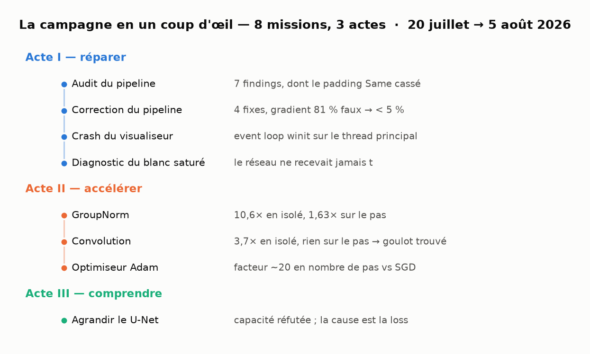

*Les 8 missions dans l'ordre chronologique. Chacune a sa branche, son rapport
Markdown et ses tests de non-régression.*

---

## 2. Les bugs et leurs mécanismes

### 2.1 Le padding fantôme — la convolution qui n'était pas centrée

**Le mécanisme.** Une convolution en mode « Same » doit produire une sortie de
la même taille que l'entrée. Pour cela elle centre sa fenêtre sur chaque pixel
et complète les bords avec des zéros. Le code calculait correctement la
*dimension* de sortie… mais le shader n'appliquait **jamais** le décalage
correspondant : il démarrait sa fenêtre en haut à gauche au lieu de la centrer.

Deux conséquences se cumulent. D'abord la carte de features **glisse d'un
demi-noyau à chaque couche `Same`**. Ensuite, les lectures débordent : WGSL les
*clampe* silencieusement sur le dernier élément au lieu de renvoyer zéro — les
bords bas et droit sont donc remplis par répétition du dernier pixel.

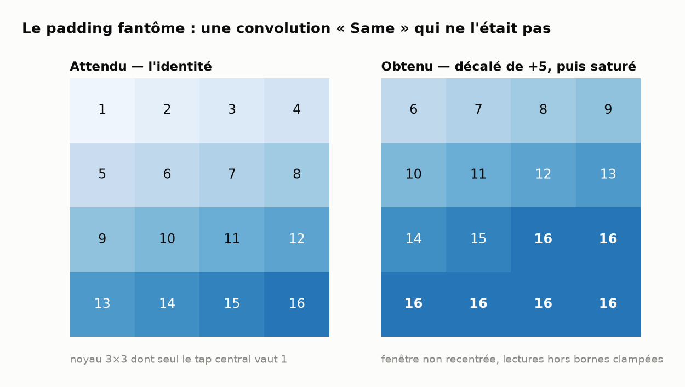

*Sortie GPU réelle du test `same_padding_conv_is_centered_and_zero_padded`
(`AUDIT_TRAINING.md` §1). Avec un noyau dont seul le tap central vaut 1, une
convolution « Same » correcte est l'identité. On obtient un décalage de +5 (une
ligne et une colonne) puis une saturation à 16.*

**Pourquoi c'était grave, et invisible.** Sur *une seule* couche, le gradient
restait cohérent : le backward était le gradient exact d'un forward faux —
l'opérateur était auto-cohérent, donc indétectable par un contrôle local. C'est
le test à **deux couches empilées** qui a démasqué le problème : le gradient
reçu par la première couche était **~5× trop petit, soit 81 % d'erreur
relative** (`AUDIT_TRAINING.md` §1, preuve b). L'erreur se compose avec la
profondeur — et un U-Net a besoin du mode `Same` partout, puisque ses connexions
`Concat` exigent des dimensions spatiales identiques.

**Le fix** corrige forward et backward **ensemble** (corriger le forward seul
aurait rendu le gradient faux) et remplace le clamp par un vrai zéro-padding
explicite. Le test empilé passe de 81 % d'erreur à moins de 5 %
(`FIX_TRAINING.md` §1). Conséquence assumée : **tous les checkpoints antérieurs
sont invalidés** — les poids avaient été appris contre un autre opérateur.

### 2.2 Le réseau qui ne connaissait pas `t`

Un modèle de diffusion apprend à retirer du bruit. À chaque étape on lui montre
une image bruitée et on lui demande : *quel est le bruit que je viens
d'ajouter ?* La difficulté de la question dépend entièrement du **niveau** de
bruit, noté `t` — et le réseau doit donc savoir à quel `t` il travaille.

**Il ne le savait pas.** Le modèle `Greyscale_Diffusion` avait une entrée et une
sortie de dimensions identiques (`[32,32,1]`), donc **zéro canal disponible pour
coder `t`**. Le réseau produisait alors forcément une réponse *moyennée sur tous
les niveaux de bruit* : à `t` faible il sous-estimait massivement l'amplitude du
bruit (écart-type prédit ≈ 0,665 pour une cible ≈ 1,0 — `INSIGHTS_TRAINING.md`
§2.1).

**Le mécanisme de l'explosion.** L'échantillonnage divise par `√α` à chaque
étape ; sur 256 étapes le produit vaut **×174,4**. Une prédiction de bruit trop
faible laisse à chaque pas un résidu, que ce facteur amplifie
multiplicativement. Le latent part sain (écart-type 0,98) et finit à **67,7** :
l'image sort massivement de sa plage et se retrouve **clampée au blanc**, avec
une minorité de pixels très négatifs — les fameuses bandes sombres.

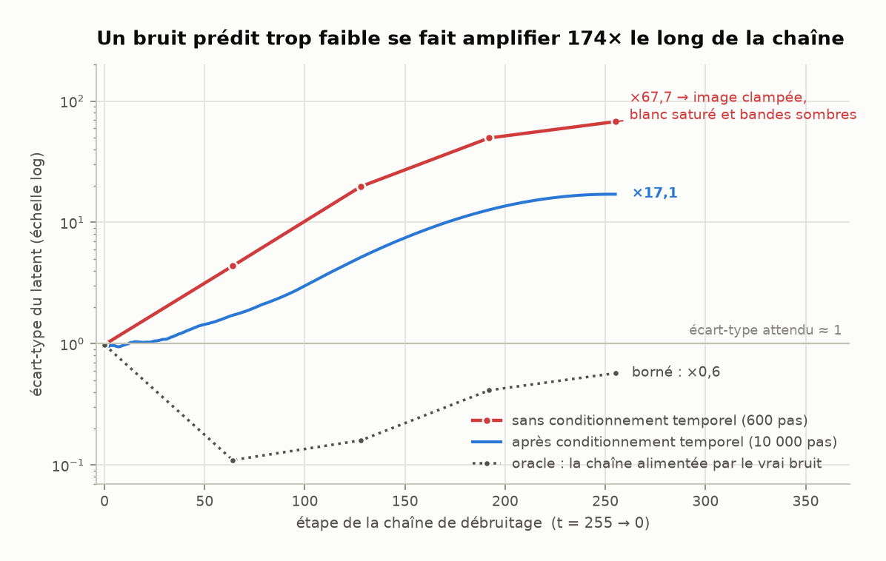

*Les deux modèles sont échantillonnés dans le pire réglage (magnitude 1,0,
1 chemin), celui que l'entraînement journalise. Sources : `INSIGHTS_TRAINING.md`
§2.2–2.3 (modèle cassé et oracle), `fable_run_metrics.jsonl` (modèle corrigé).
La courbe pointillée est le contrôle décisif : alimentée par le **vrai** bruit
résiduel, la même chaîne inverse reste bornée et reconstruit l'image
exactement (rmse = 0). Le sampler est donc innocenté — le blanc saturé est
à 100 % un problème de qualité de la prédiction.*

**Le fix** ajoute deux canaux d'embedding temporel en entrée (`[32,32,3]`), avec
un encodage sinusoïdal **lisse et normalisé** : `τ = t/(T−1)`, dont la plus
basse fréquence `cos(πτ)` est strictement monotone sur tout le schedule. L'ancien
encodage utilisait `sin(step)` — de période ≈ 6,28 *pas* — donc un code de `t`
quasi aléatoire, inexploitable. Une garde a été ajoutée au build : la profondeur
du noyau doit égaler celle de l'entrée (`KernelChannelMismatch`), le piège
exact qui avait rendu le premier essai silencieusement inopérant.

### 2.3 L'échelle du bruit — un schedule qui n'atteignait jamais le bruit pur

Les bornes de bruit `β ∈ [1e-4, 0.02]` sont celles du papier DDPM, où elles sont
calibrées pour **T = 1000 étapes**. Le projet les réutilisait telles quelles à
**T = 256**. Résultat : à la fin du processus d'ajout de bruit, l'image
conservait **27,4 % de son signal d'origine** au lieu de ~0,6 %.

| T | `ᾱ_T` | signal résiduel dans `x_T` |
|---|---|---|
| 1000 (référence DDPM) | 4,04e-5 | 0,64 % |
| 256 — **avant** | 7,50e-2 | **27,4 %** |
| 256 — **après** | 3,29e-5 | **0,57 %** |

*(`FIX_TRAINING.md` §3)*

Concrètement : à l'entraînement, le modèle ne voyait jamais autre chose qu'une
image encore reconnaissable ; à la génération, on lui présentait du bruit pur.
Décalage train/inférence sur le pas **le plus critique** de toute la chaîne. Le
fix rééchelonne les bêtas par `1000/T` et ajoute une **assertion de
construction** : toute combinaison (T, bêtas) qui n'atteint pas le bruit pur
échoue désormais bruyamment au lieu de dégrader silencieusement l'entraînement.

Le même acte a corrigé un défaut jumeau : les données étaient normalisées en
`[0,1]` alors que la diffusion suppose des données **centrées**. Avec une
moyenne de 0,5, chaque image gardait un biais à tous les niveaux de bruit, tandis
que l'échantillonneur démarre d'un bruit de moyenne nulle. Le format `.batraw`
a gagné un magic `BATRAW2` (charge utile déjà en `[-1,1]`), les anciens fichiers
`BATRAW1` restant lisibles et rééchelonnés à la volée — le dataset du dépôt
continue de fonctionner sans régénération.

### 2.4 Le timestep collé à l'image

DDPM exige que le niveau de bruit `t` soit tiré **au hasard, indépendamment de
l'image**. Or les deux dérivaient du même compteur linéaire : l'image `i`
recevait toujours le timestep `i mod 256`. Le nombre de niveaux de bruit qu'une
image donnée pouvait voir sur *toute* la durée de l'entraînement valait
`gcd(50 000, 256)` — soit **16 niveaux sur 256, 6 % du schedule**
(`AUDIT_TRAINING.md` §2). Corollaire : le dataset n'était **jamais mélangé**,
l'ordre de présentation étant identique à chaque époque.

Le fix tire `t` uniformément via un générateur SplitMix64 seedé sur le pas, et
ajoute une permutation Fisher-Yates du dataset régénérée à chaque époque —
dérivée du numéro d'époque, donc **reproductible d'un run à l'autre**.

### 2.5 Le crash du visualiseur

Enfin, un bug d'une autre nature : sur macOS, le visualiseur ne pouvait **jamais**
fonctionner. winit exige que sa boucle d'événements vive sur le thread principal
du processus (contrainte AppKit dure, sans échappatoire), et elle était créée
dans un thread secondaire. Le panic déversait un backtrace complet par-dessus
l'écran alterné du TUI — d'où l'impression de crash. Sous Linux, le bug était
masqué par des appels `with_any_thread(true)` qui n'existent pas sur macOS.

Le correctif inverse le threading : la boucle d'événements possède le thread
principal, le TUI et l'entraînement tournent sur un worker. Vérification :
310 frames présentées, stderr **vide** pendant tout un run, sortie propre
(`CRASH_VISUALISER.md` §4).

---

## 3. Les chiffres

### 3.1 Une loss qui descend ne prouve rien

C'est le fil rouge méthodologique de toute la campagne. L'audit l'établit dès le
départ : avant les fixes, la perte descendait *aussi* — « le réseau minimise
honnêtement un mauvais opérateur ». La courbe de perte est une condition
nécessaire, jamais une preuve.

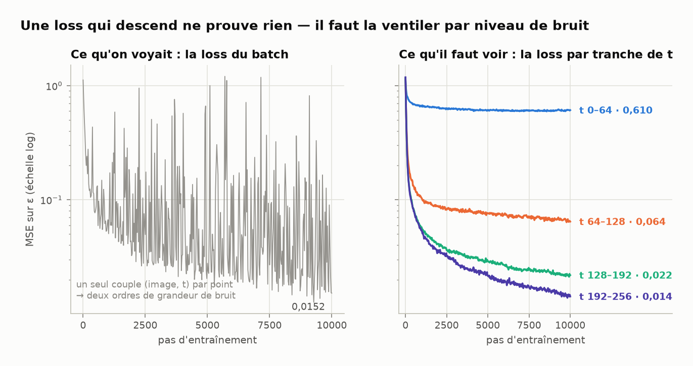

*Run de référence `Greyscale_Diffusion` : 10 000 pas, SGD, lr 1e-3, batch 16,
CIFAR-10 en niveaux de gris. Source : `fable_run_metrics.jsonl`, 401 points de
sonde. À gauche, la perte du batch : elle n'échantillonne qu'un seul couple
(image, niveau de bruit) par point, d'où deux ordres de grandeur de bruit de
mesure. À droite, la même mesure ventilée par tranche de `t` sur un jeu de sonde
fixe : c'est le diagnostic exploitable.*

L'instrumentation ajoutée à l'acte I écrit un fichier JSONL à côté de chaque
checkpoint : perte par tranche de `t`, statistiques du bruit prédit contre le
bruit réel, et la **trajectoire complète de débruitage** (256 étapes) des
échantillons périodiques. C'est cet outillage qui a rendu tout le reste
mesurable.

### 3.2 Adam contre SGD — un facteur 20 en nombre de pas

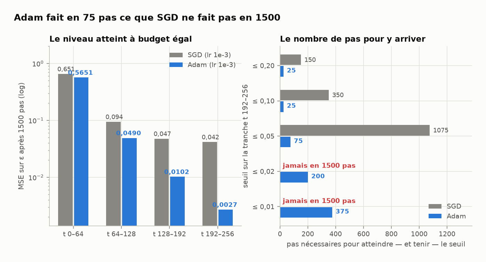

*Comparaison appariée sur la baseline, 1500 pas, batch 16. Sources :
`OPTIMIZER_ADAM.md` §3 (niveaux atteints, moyenne des pas 1400–1499) et §3.1
(pas nécessaires pour atteindre **et tenir** un seuil).*

Le chiffre qui résume : **sur les quatre tranches à la fois, Adam atteint dès le
pas 75 un niveau que SGD n'atteint jamais en 1500 pas.** Sur la tranche haute,
l'écart final est de 14,4×.

L'appariement est structurel, pas un réglage : toute quantité aléatoire du run
dérive du seul indice de pas, donc deux runs de même longueur voient des entrées
**octet pour octet identiques** — vérifié empiriquement (perte au pas 0 bit à bit
identique entre bras). Toute différence observée est un effet d'optimiseur, et
rien d'autre.

Deux résultats annexes, l'un utile, l'autre inattendu :

- **Le surcoût d'Adam est non mesurable** : −0,2 ms sur ~620 ms/pas, soit sous
  le plancher de bruit de l'instrument (`OPTIMIZER_ADAM.md` §5, où l'écart entre
  deux répétitions d'un *même* bras atteint 6 ms). Le pas est dominé par les passes
  avant/arrière ; la mise à jour des poids est un seul kernel sur 19 409
  paramètres. Coût mémoire : 152 Kio d'état.
- **L'initialisation He est en retrait**, partout, sur cette architecture.
  L'explication la plus plausible : une `GroupNorm` suit la plupart des
  convolutions et neutralise en aval l'échelle des poids — précisément ce que He
  fixe. Ce résultat est livré avec sa réserve : le tirage uniforme historique
  est dégénéré (un seul flux PRNG partagé entre couches), donc l'ablation compare
  **deux variables à la fois** et ne clôt pas la question (`OPTIMIZER_ADAM.md`
  §4).

### 3.3 Performance — le gain qui ne se transmet pas

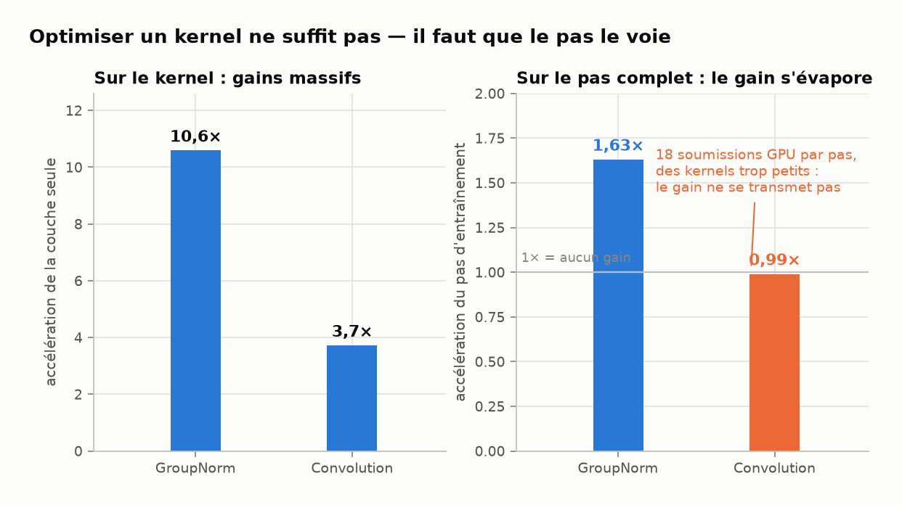

*`GroupNorm` : 9,47 → 0,89 ms par échantillon sur les couches isolées, et
498,5 → 305,8 ms/pas bout-en-bout (`PERF_GROUP_NORM.md` §4.1–4.2). Convolution :
2,30 → 0,62 ms par échantillon en isolé, mais 549 → 555 ms/pas bout-en-bout,
soit **+1 %** (`PERF_CONVOLUTION.md` §5.2–5.3). Le contrôle nul de l'instrument —
la même paire rejouée avec deux copies du même binaire — donne 0,09 %, donc la
mesure résout bien mieux que l'effet cherché.*

Les deux missions ont appliqué la même idée — remplacer des recalculs par
élément par des **réductions par workgroup** — avec deux issues opposées, et
c'est la seconde qui a le plus appris :

- Sur `GroupNorm`, le banc isolé était un **minorant** du gain réel (137 ms/pas
  prédits, 193 ms observés).
- Sur la convolution, le gain isolé **ne se transmet pas du tout**. L'explication
  a été cherchée puis honnêtement laissée à l'état d'hypothèse faute de sonde
  fiable : les kernels optimisés sont descendus au niveau du **coût fixe d'une
  passe de calcul**, que le banc isolé masque en enchaînant 200 copies dans un
  seul encodeur.

Ce que la mission a **établi**, en revanche, c'est le goulot structurel : le
batch est déroulé côté CPU, un encodeur et une soumission GPU **par échantillon**
— soit 18 soumissions par pas à batch 16 — et chaque convolution ne travaille
donc jamais que sur un seul petit tenseur (le forward de la dernière conv n'a
que 1024 éléments de sortie, soit 16 workgroups). Trois observations
indépendantes en découlent : le *register-blocking* du forward s'est révélé
**plus lent** (jusqu'à 0,47× — implémenté, mesuré, rejeté), les réductions du
backward n'avaient à l'origine que 5 à 144 workgroups à faire tourner, et le
gain isolé s'évapore. **Porter la dimension batch dans le dispatch** attaquerait
les trois d'un coup ; c'est de loin le plus gros gain restant.

Point d'exigence sur ces deux missions : les optimisations sont **prouvées
équivalentes**, pas supposées telles. Sur 600 pas d'entraînement réel, la
trajectoire de perte est identique à toutes les décimales affichées, et l'écart
absolu maximal sur les 821 enregistrements JSONL est de 3,8e-6 (`GroupNorm`) et
2,1e-6 (convolution). Mieux : un oracle en double précision montre que la
nouvelle réduction en arbre est **11× plus proche de la vérité** que la somme
séquentielle qu'elle remplace.

### 3.4 Le mode collapse, mesuré

Le pipeline sain, le modèle converge — et produit toujours la même image.
L'hypothèse « manque de capacité » a été testée en construisant
`Greyscale_Diffusion_L` : un étage de plus (32 → 16 → 8), 2 à 4× plus de noyaux,
28 couches au lieu de 12, **11,7× de calcul**, **24× de paramètres**, et un champ
réceptif porté de 13 px à 35 px — c'est-à-dire couvrant enfin l'image entière
de 32 px, ce que la baseline ne faisait pas.

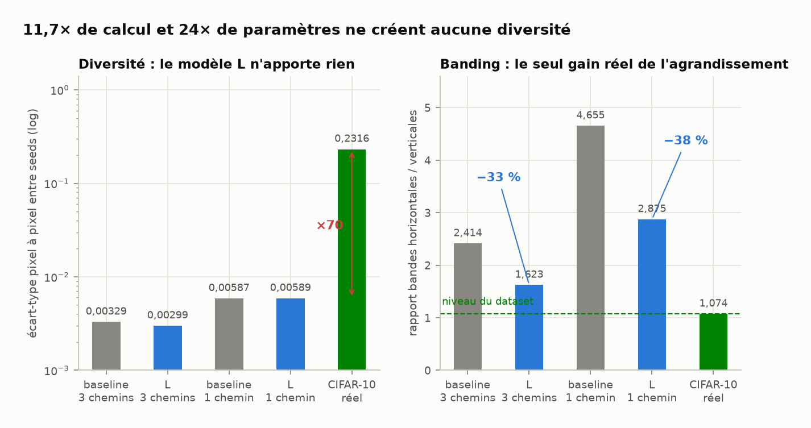

*8 échantillons par configuration (graines 1 à 8), 16 images réelles comme
repère. Source : `SCALE_UNET.md` §4, mesures de `tools/sample_diversity.py`.*

Le verdict est net : **aucun gain de diversité** (0,00299 contre 0,00329, à ~70×
sous le dataset), et le modèle L est même légèrement moins bon sur les quatre
tranches de `t`. Le seul effet mesurable est la chute du **banding de 33 %**, qui
valide exactement la partie « champ réceptif » du raisonnement — sans toucher au
problème principal.

### 3.5 L'inversion de lecture — ce que la métrique disait vraiment

L'agrandissement n'ayant rien donné, la question est devenue : *que mesure-t-on
au juste ?* Deux calculs ont retourné la lecture de toutes les métriques
précédentes.

Le premier est une identité exacte. Puisque le bruit cible se déduit de l'image
propre, une erreur de reconstruction se traduit en erreur de bruit par un facteur
qui ne dépend que de `t` :

```
MSE(bruit prédit, bruit réel) = [ ᾱ / (1−ᾱ) ] · MSE(image reconstruite, image réelle)
```

Ce facteur vaut **2559 à t = 0** et **0,003 à t = 224**. La métrique est donc une
loupe dont le grossissement varie de six ordres de grandeur le long du schedule.

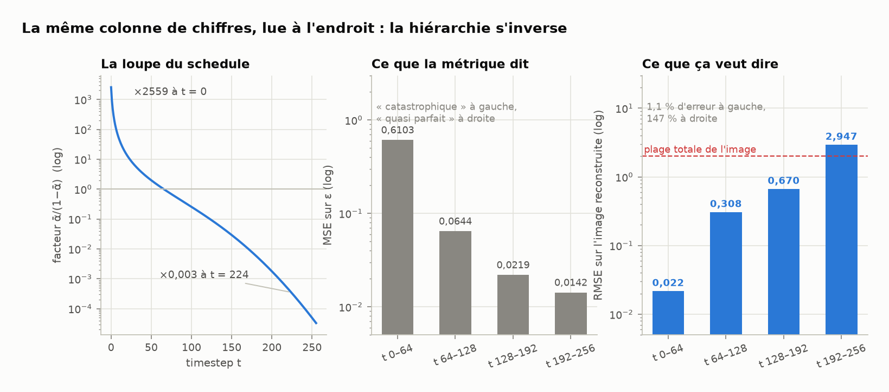

*Source : `SCALE_UNET.md` §5.1 (`tools/eps_metric_analysis.py`) ; le schedule de
production est recalculé dans le script de figures.*

**La hiérarchie s'inverse.** La tranche jugée « catastrophique » (perte 0,61)
correspond en réalité à une reconstruction de l'image **à 1,1 % près** : c'est le
meilleur régime du modèle. Les tranches « quasi parfaites » (0,014) correspondent
à une erreur de **147 %** sur l'image — c'est-à-dire aucune connaissance du tout.
Le « haut-`t` quasi parfait » célébré dans `INSIGHTS_TRAINING.md` §4.1 était donc
un **artefact de métrique** : à `t` élevé, l'entrée *est* pratiquement du bruit,
et la recopier suffit.

Le second calcul confirme empiriquement, en comparant les modèles à des
prédicteurs à zéro paramètre.

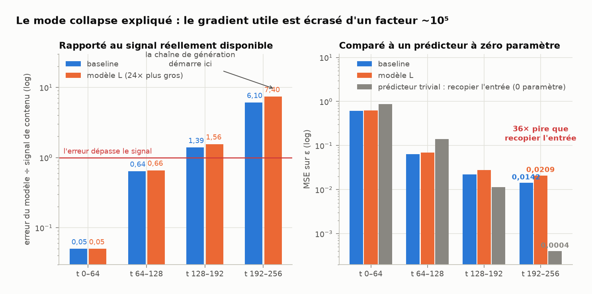

*Signal de contenu = la seule part de la cible qui porte l'image. Prédicteurs
triviaux calculés sur 256 images réelles du dataset. Source : `SCALE_UNET.md`
§5.2–5.3 (`tools/trivial_baselines.py`).*

**Voilà le collapse, en une phrase.** L'échantillonnage démarre à `t = 255` et
descend : c'est pendant les premières étapes que le contenu global de l'image se
choisit. Or à `t` élevé l'erreur du modèle vaut **6 fois l'intégralité du signal
de contenu disponible** (7,4 fois pour le modèle L) — sa sortie n'y contient
strictement rien d'exploitable sur *quelle* image produire. Il ne peut suivre que
le seul attracteur compatible avec toutes les données : la moyenne. Quand la
chaîne atteint enfin le `t` bas où le modèle excelle (erreur = 0,05× le signal),
le contenu est déjà figé, et le modèle ne fait plus qu'affiner proprement… une
image moyenne.

La cause est structurelle et **indépendante de l'architecture** : la perte non
pondérée applique un facteur d'amplification de **1282 en moyenne** à la tranche
`t 0–64` et de **0,003** à la tranche `t 192–256` — quatre à cinq ordres de
grandeur d'écart. **Le gradient qui devrait apprendre le contenu de l'image est
écrasé d'un facteur ~10⁵ par rapport à celui qui affine des détails déjà
acquis** (`SCALE_UNET.md` §5.3). Aucune quantité de capacité ne compense une
pondération pareille — ce que le run du modèle L démontre précisément.

---

## 4. Les planches d'images

### Avant / après le conditionnement temporel

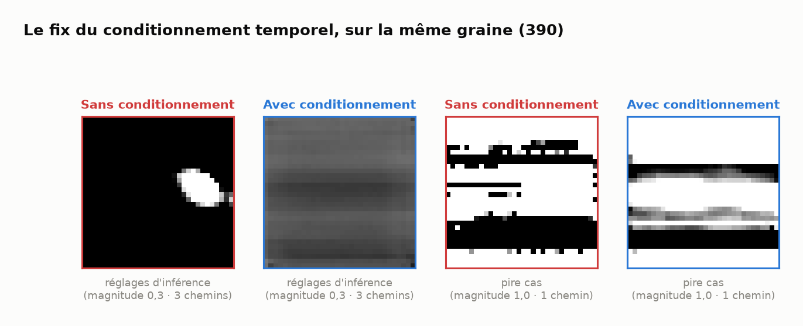

*Même graine (390), via `--headless-sample`. Source : `INSIGHTS_TRAINING.md`
§4.2, fixtures dans `insights_samples/`.*

Le modèle sans conditionnement produit une image **bimodale saturée**, avec un
latent hors de `[-1, 1]` d'un facteur ~27 (ici clampé côté noir ; le signe
dépend de l'état dégénéré — le run de 20 000 pas d'origine clampait côté blanc).
Le modèle corrigé, aux réglages d'inférence du config, produit une image
**entièrement dans `[-0,76 ; -0,08]`, avec 0 % de pixel saturé**. Ce n'est pas
encore une belle image — l'entraînement de 6000 pas ne représente que
~1,9 époque — mais c'est une vraie image en niveaux de gris, et la saturation a
disparu.

En pire cas (mono-chemin, bruit stochastique plein), le modèle corrigé reste
fragile mais son latent est **~16× moins explosé** que le cassé (mesuré sur le
run de 6000 pas ; la figure du §2.2 montre la même grandeur pour le run de
10 000 pas, ×17,1 contre ×67,7).

### Baseline, modèle L, et le plafond réel

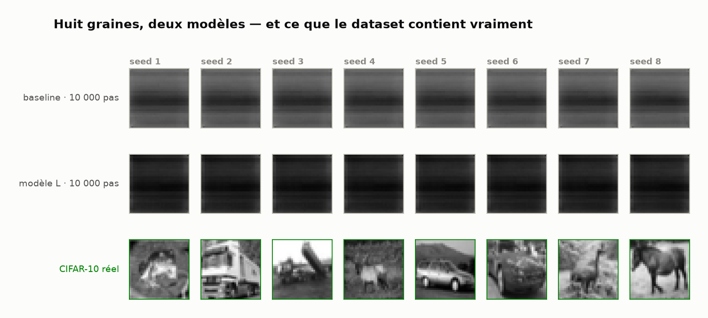

*Huit graines par modèle, réglages d'inférence du config (3 chemins,
magnitude 0,3). La rangée du bas est lue directement dans
`datasets/cifar10_grey.batraw` — c'est le plafond qu'un modèle parfait
atteindrait. Source : `scale_samples/`.*

Cette planche est le résultat de l'acte III en une image : les huit colonnes de
chaque modèle sont **indiscernables entre elles**. Le modèle L a bien perdu une
partie de son banding horizontal — l'argument du champ réceptif tient — mais il
ne produit pas davantage de contenu. La distance à la rangée du bas est le
travail qui reste.

---

## 5. Où on en est, et ce qui reste

### L'état du pipeline

Tout ce qui pouvait fausser silencieusement l'entraînement a été trouvé, corrigé
et verrouillé par des tests :

| | état |
|---|---|
| Convolution `Same` (forward + backward) | corrigée, gradient vérifié par différences finies sur deux couches empilées |
| Normalisation des données | `[-1,1]`, encodage/décodage symétriques, format rétro-compatible |
| Schedule de bruit | recalibré, avec assertion de construction |
| Tirage du timestep + mélange du dataset | uniforme et indépendant, permutation par époque |
| Conditionnement temporel | présent, embedding lisse, cohérence GPU/CPU testée |
| Sampler | innocenté par oracle ; moyenne postérieure calculée depuis un `x₀` clippé |
| Instrumentation | JSONL par run (perte par tranche, stats, trajectoire de débruitage) |
| Débit | 498,5 → ~306 ms/pas ; Adam disponible (~20× en nombre de pas) |
| Visualiseur | fonctionnel sur macOS |

### Ce qui reste — par ordre de rapport gain/coût

1. **Pondérer la loss, ou changer de paramétrisation.** C'est la cause **prouvée**
   du mode collapse. Trois options, de la moins à la plus invasive : une
   pondération `min(SNR, γ)` (ou `1/amplification(t)`) appliquée au gradient —
   quelques lignes, aucun changement d'architecture ; la **prédiction de `x₀`**,
   dont la cible a une amplitude constante à tout `t` et qui supprime du même
   coup l'amplification `1/√α` à l'échantillonnage ; ou la **prédiction de `v`**,
   le compromis standard.

   **En cours de validation** (branche `loss-weighting`, commit `a605dd5`) : la
   première option, par la porte la plus économique. Plutôt que de pondérer le
   gradient, l'entraînement **biaise le tirage du timestep** — `t ~ p(t) ∝ w(t)`
   avec `w(t) = min(1, γ/SNR(t))` (min-SNR-γ), mélangé à 5 % d'uniforme pour que
   `t = 0` conserve quelques tirages. En espérance c'est exactement une loss
   pondérée, à une constante près sans effet sous Adam — **aucun shader ni passe
   arrière n'est touché**. Le chemin uniforme reste bit à bit l'ancien tirage
   (test de non-régression), et le probe de diagnostic garde son tirage uniforme
   par tranche pour rester comparable aux runs précédents.

   **Critère de succès, déjà outillé** : l'erreur sur `t 192–256` doit passer
   sous 1× le signal de contenu et battre le prédicteur trivial
   (`tools/trivial_baselines.py`).
2. **Porter la dimension batch dans le dispatch GPU** — un seul encodeur par pas
   au lieu de 18 soumissions. C'est le plus gros gain de performance restant, et
   il débloque en prime toutes les optimisations de kernel actuellement rendues
   inutiles par le sous-parallélisme.
3. **Rendre utilisable la sonde de coût fixe par passe** (une ligne : minimum sur
   N rondes au lieu d'un échantillon unique). Sans elle, on ne sait pas si les
   kernels actuels sont encore optimisables ou déjà collés au plancher.
4. **Refaire la mesure bout-en-bout de la convolution sur une machine libre.**
   La question « les optimisations font-elles gagner ou perdre ~1 % ? » est
   **ouverte** : la mesure repose sur une fenêtre unique, et la tentative de
   reproduction a échoué faute de GPU disponible. Une demi-heure sur une machine
   sans co-locataire, avec les quatre bras déjà outillés.
5. **Ne pas ré-agrandir le modèle tant que 1 n'est pas fait.** Une fois le
   haut-`t` porteur de gradient, l'architecture L (champ réceptif 35 px, banding
   déjà −33 %) redevient le bon candidat — mais la tester avant serait refaire un
   run déjà fait.

### Ce qui n'est pas prouvé

Par honnêteté de dossier, trois réserves explicites, reprises des rapports :

- Le modèle L n'est pas disqualifié : il a été entraîné sous l'objectif
  défaillant, comme la baseline. Son désavantage à budget de pas égal est
  vraisemblablement dû au SGD nu, pas à l'architecture.
- La pondération de la loss traite la cause **mesurée**. Elle ne dit rien d'un
  éventuel second facteur limitant qui n'apparaîtra qu'une fois celui-ci levé.
- Le verdict « initialisation uniforme » est le plus fragile à transposer au
  modèle L : la profondeur est précisément le régime où l'initialisation compte
  le plus. Si un run L sous-performe, c'est le premier paramètre à rejouer.

---

## Annexe — la méthode

Ce n'est pas le sujet du document, mais c'est ce qui rend les chiffres
ci-dessus utilisables. Cinq principes ont été tenus par toutes les missions.

**Les mesures sont appariées, et l'appariement est structurel.** Toute quantité
aléatoire dérive de l'indice de pas : deux runs de même longueur voient des
entrées octet pour octet identiques. Il n'y a pas de graine d'entraînement à
passer — la reproductibilité n'est pas optionnelle. Vérifié empiriquement, pas
supposé : la perte au pas 0 est bit à bit identique entre bras.

**Les bancs sont bâtis contre la contention.** Le GPU était partagé entre
plusieurs agents. Plutôt que de l'ignorer, chaque banc entrelace ses bras dans un
seul processus sur les mêmes buffers, prend le **minimum** sur N rondes comme
estimateur (la contention ne peut qu'ajouter du temps) et publie un **contrôle
nul** — la même paire rejouée avec deux copies du binaire identique — pour
établir le plancher de bruit de l'instrument. Les séries dont le contrôle nul
était mauvais ont été **écartées et documentées**, pas repêchées.

**Chaque optimisation est prouvée équivalente par deux oracles indépendants.**
Les shaders d'avant optimisation sont conservés **verbatim** comme fixtures et
redispatchés sur exactement le même bind group ; en parallèle, un oracle en f64
tranche quand les deux versions f32 diffèrent. Le test n'exige pas seulement la
proximité, mais que **la nouvelle implémentation ne soit jamais moins précise que
l'ancienne**. Les différences finies servent de troisième oracle, ignorant les
deux implémentations.

**Les tests sont vérifiés par mutation.** Trois mutations délibérées sur
`GroupNorm`, cinq sur la convolution, toutes recompilées, toutes attrapées. C'est
ce qui distingue une suite de tests d'un décor : un biais de 0,1 % passe sous la
tolérance des différences finies mais très au-dessus de celle de la comparaison
ancien/nouveau — **aucun oracle seul ne suffirait**.

**Les résultats négatifs sont livrés, pas enterrés.** Le register-blocking du
forward a été implémenté, mesuré, rejeté, et son raisonnement laissé en
commentaire dans le shader pour que la piste ne soit pas retentée à l'aveugle.
Un retuning des lanes a été écrit puis **non livré**, faute de mesure
reproductible. Le modèle L est conservé comme témoin d'un résultat négatif. Et
quand un test d'audit s'est révélé insatisfiable par construction, la réserve a
été écrite noir sur blanc dans le rapport au lieu d'être lissée.

---

## Épilogue — la nuit du 4 au 5 août

Deux expériences ont conclu la campagne pendant la nuit.

**La pondération de la loss : NO-GO, et c'est une donnée.** L'hypothèse finale
de `SCALE_UNET.md` — le contenu global serait sacrifié parce que la loss écrase
le gradient des t hauts — a été testée en bras appariés (min-SNR par tirage
biaisé des timesteps, aucun shader modifié). Résultat : ×1,20 sur le haut-t là
où le critère exigeait ×10 (`LOSS_WEIGHTING.md`). L'explication est arithmétique :
le déséquilibre « ×10⁵ » était exprimé en unités x₀ ; dans les unités ε où le
gradient est réellement calculé, il ne vaut que ×5,7 — et la pondération rend
exactement ce que ×5,7 peut rendre. Les deux bras plafonnent au même endroit :
le haut-t n'était **pas** affamé de gradient.

**Le run de nuit : les meilleures métriques du projet, et le même collapse.**
8 000 pas, modèle L + Adam (lr 10⁻³), la configuration recommandée par
`OPTIMIZER_ADAM.md`. Loss par tranche finale : 0,49 / 0,044 / 0,0076 / 0,0015 —
la tranche « contenu » est 12× meilleure que le même modèle sous SGD, l'écart au
prédicteur trivial se resserre de ×36 à ×2,5. Et pourtant : les images générées
restent des bandes horizontales quasi identiques d'un seed à l'autre
(`morning_samples/`), et le banding *empire* (ratio 9,4 contre 1,6 sous SGD).

**L'indice qui reste.** Les images générées sont presque **unidimensionnelles** :
la variation colonne-à-colonne y est ~10× plus faible que rangée-à-rangée
(`col_diff_rms` 0,004 contre `row_diff_rms` 0,035), alors que le dataset est
isotrope (0,096 contre 0,103). Un modèle dont la reconstruction d'entraînement
est excellente mais dont la génération ne dépend que de y, sur deux
architectures et deux optimiseurs, pointe vers une cause structurelle du
framework — le prochain chantier, avec le portage de l'axe batch dans le
dispatch GPU.

Quatre hypothèses sont éliminées et documentées : capacité, champ réceptif
(il explique le banding de SGD, pas le collapse), famine de gradient à t haut,
optimiseur. Ce rétrécissement du champ des causes est le vrai livrable de la
nuit.

---

## Index des sources

| Rapport | Contenu |
|---|---|
| `AUDIT_TRAINING.md` | Audit du pipeline : 7 findings, tests diagnostiques, ordre de correction |
| `FIX_TRAINING.md` | Correction des findings #1–#4, preuves, chemin `--headless-train` |
| `CRASH_VISUALISER.md` | Crash macOS du visualiseur : cause AppKit, inversion du threading |
| `INSIGHTS_TRAINING.md` | Blanc saturé : cause racine prouvée, instrumentation JSONL, guérison |
| `PERF_GROUP_NORM.md` | `GroupNorm` : réductions par workgroup, 10,6× isolé / 1,63× pas |
| `PERF_CONVOLUTION.md` | Convolution : 3,7× isolé, découverte du goulot batch-dispatch |
| `OPTIMIZER_ADAM.md` | Adam vs SGD, ablation He, coût par pas, recommandation |
| `SCALE_UNET.md` | Modèle L : capacité réfutée, la cause est la pondération de la loss |
| `synthese_assets/make_figures.py` | Génération des figures de ce document |

Métriques brutes : `Models/Greyscale_Diffusion/pretrained_weights/fable_run_metrics.jsonl`
(non versionné). Outils d'analyse : `tools/`.
