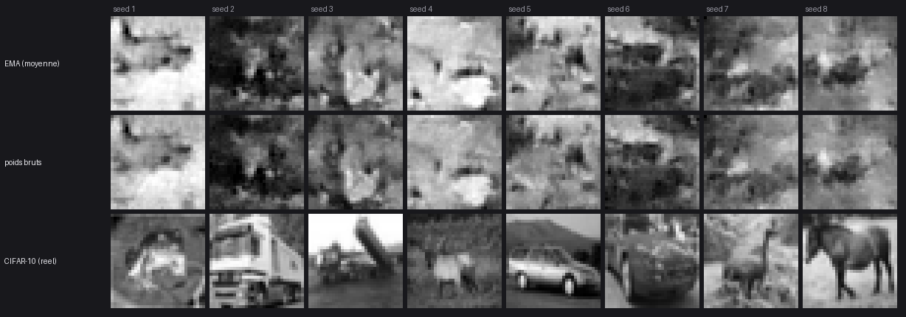

# EMA des poids, `--resume`, checkpoints périodiques

Branche `ema`. Trois items complémentaires autour de la qualité et de la
robustesse d'entraînement, plus un bug préexistant exhumé en chemin.

**Résumé** — l'EMA est implémentée, gratuite quand on ne la demande pas (run et
checkpoint inchangés au bit près), et **elle ne s'est pas montrée payante à
1500 pas** : sur un checkpoint unique, 16 seeds par bras, elle déplace la sortie
de façon parfaitement systématique (16/16) mais les deux tiers de ce
déplacement sont un simple gain de contraste, un indicateur sur trois va dans le
bon sens, un est à l'équilibre et un va dans le mauvais. Détail et verdict en
§5 — l'échelle où l'EMA est réputée payer n'est pas celle-là.

---

## 1. Ce qui est implémenté

### 1.1 La passe EMA (`crates/batlab-core/src/model/shader/ema.wgsl`)

Une passe compute par couche entraînable, encodée **après** la passe
d'optimiseur, dans le même encodeur :

```
ema_weights[i] ← d·ema_weights[i] + (1−d)·weights[i]
ema_bias[i]    ← d·ema_bias[i]    + (1−d)·bias[i]
```

Bindings : `[0]` weights (lecture), `[1]` bias (lecture), `[2]` ema_weights
(rw, persistant), `[3]` ema_bias (rw, persistant), `[4]` l'uniforme `EmaSpecs`.
Deux buffers de la taille des poids par couche, alloués avec les passes
d'optimiseur, exactement la plomberie des moments `m`/`v` d'Adam
(`OptimizerBindings`, `create_opt_pass`).

**Passe séparée plutôt que fondue dans `adam.wgsl`/`sgd.wgsl`.** La récurrence
est la même quel que soit l'optimiseur qui a produit les poids ; une passe à
elle seule est une passe qu'on peut lire, tester et éteindre à elle seule. La
barrière implicite que wgpu insère entre deux passes compute d'un même encodeur
est ce qui fait que l'EMA lit les poids **de ce pas-ci** et pas ceux du pas
précédent — le test l'exige (voir la mutation n° 4, §4.2).

### 1.2 Le warmup : le choix, et pourquoi l'autre a été écarté

`ema ← d·ema + (1−d)·w` avec d = 0,999 a une constante de temps de mille pas.
Partie de l'initialisation aléatoire, la moyenne serait encore majoritairement
du bruit mille pas plus tard — elle serait **pire** que les poids bruts sur
tout le début du run.

Deux mécanismes, **tous deux appliqués** :

1. **Le shadow est semé avec les poids** au moment où la passe est construite
   (`Layer::create_ema_pass`), jamais avec des zéros. Il ne contient donc jamais
   rien que le modèle n'ait tenu d'abord.
2. **La décroissance est rampée** : `d(t) = min(decay, (1+t)/(10+t))`.

La rampe est la règle `ExponentialMovingAverage(num_updates=t)` de TensorFlow.
Elle a été préférée à la **correction de biais** (`ema / (1 − dᵗ)`, le tour
d'Adam appliqué à un shadow initialisé à zéro) pour une raison précise : la
correction de biais *suppose* un shadow parti de zéro, donc elle **interdit** de
le semer sur les poids — et un shadow parti de zéro est un shadow dont tous les
checkpoints des premiers milliers de pas génèrent du bruit. La rampe se
**compose** avec le semis au lieu de le contredire.

Repères : `d(1) = 0,182` · `d(10) = 0,55` · `d(100) = 0,918` ·
`d(1000) = 0,991` ; le 0,999 nominal prend la main vers **t ≈ 9990**.

> **À retenir pour un run court.** Sur 1200 pas, `d(1200) = 0,9926 < 0,999` :
> c'est la **rampe** qui lie tout du long, quelle que soit la valeur nominale
> demandée. La fenêtre effectivement moyennée fait ~135 pas en fin de course,
> pas 1000 — et `--ema 0.9999` y donnerait exactement le même résultat que
> `--ema 0.999`. La valeur nominale ne commence à distinguer les runs qu'au-delà
> de ~10 000 pas.

Le decay effectif est calculé **sur le CPU en f64** et passé en uniforme, comme
les corrections de biais d'Adam et pour la même raison : le compteur de pas vit
là, et le ratio est à un cheveu de 1 sur l'essentiel d'un run.

### 1.3 Le format de checkpoint : `BBCKPT3`

Troisième version, même patron que `BBCKPT2` (`OPTIMIZER_ADAM`) et `BATRAW2` :

```
BBCKPT1 : entrées poids/biais
BBCKPT2 : BBCKPT1 + remorque d'état d'optimiseur (tag, t, m/v par couche)
BBCKPT3 : BBCKPT2 + remorque EMA (tag, decay, [ema_weights, ema_bias] par couche)
```

**`BBCKPT3` n'est écrit que par un run qui garde une moyenne.** Un run sans
`--ema` produit toujours l'octet pour octet le `BBCKPT2` qu'il produisait avant
que ce fichier existe — la version est décidée par ce qu'il y a à écrire, pas
par ce que le code sait écrire.

V1 et V2 restent lisibles. Charger un V1/V2 dans un run qui moyenne **resème le
shadow sur les poids chargés** ; le laisser sur le tirage aléatoire de la
construction est le mode de défaillance qui compte ici — le run aurait l'air
sain pendant des heures en écrivant des moyennes moitié-poids-entraînés,
moitié-bruit.

### 1.4 Quel jeu de poids atterrit où

`CheckpointWeights::{Raw, Ema}` est un paramètre du **chargement**, décidé au
site d'appel, pas un état du modèle :

- **l'entraînement reprend sur l'itéré** (`Raw`) — les moments d'Adam décrivent
  cet itéré, et la moyenne n'est pas un point que l'optimiseur ait jamais
  visité ;
- **la génération prend la moyenne** (`Ema`) quand le fichier en porte une,
  parce que c'est le jeu pour lequel la moyenne existe.

Les quatre chemins de génération (les deux headless et les deux du TUI) passent
par `load_sampling_checkpoint` : une décision en un endroit au lieu de quatre
qui peuvent diverger. `CheckpointLoad` rapporte `carries_ema` **et** `used_ema`,
et leur écart est exactement le cas — « j'ai demandé la moyenne, le fichier n'en
a pas » — qui transformerait une comparaison EMA/brut en comparaison d'une chose
avec elle-même. Les deux chemins **l'annoncent à l'écran**.

### 1.5 `--resume` (item 2)

Le chemin headless forçait `load_checkpoint = false` : impossible de continuer
un entraînement en ligne de commande. `--resume <ckpt>` charge poids + moments
Adam + compteur de pas `t` + EMA et poursuit. Il écrit dans `--out`, donc un run
repris **n'écrase jamais le fichier dont il vient** sauf si on le lui demande.
Il prend le pas sur le mode de chargement du `config_file` : c'est une
instruction explicite de ligne de commande contre un défaut.

### 1.6 `--checkpoint-every N` (item 3)

**Rotation, pas historique** : un seul fichier `<out stem>.partial.ckpt`,
réécrit à chaque fois. Le besoin servi est « un run de dix heures qui meurt à la
neuvième n'est pas perdu », pas « garder tous les intermédiaires » — dix-sept
fichiers de 7 Mo pour une nuit d'entraînement serait une autre fonctionnalité,
et un moins bon défaut.

L'écriture est **atomique** : fichier temporaire à côté de la cible, puis
`rename`. Un checkpoint pèse des dizaines de mégaoctets ; un kill au milieu d'un
`fs::write` laisserait un fichier tronqué qui finit quand même en `.ckpt`, et le
run qui le reprend échouerait sur une longueur — au mieux. Avec le rename, le
partiel est toujours soit le précédent en entier, soit le nouveau en entier.

Un échec d'écriture **n'est jamais fatal** (un run ne meurt pas d'un disque
plein au pas 5000) mais il est bruyant à chaque occurrence.

C'est un `.ckpt` ordinaire, et c'est voulu : `--resume` et le sélecteur de poids
du TUI le voient tous les deux — le but est de pouvoir rattraper un run mourant.

### 1.7 Le TUI

Une cinquième ligne au formulaire d'entraînement, « EMA decay », entre « Steps »
et le bascule « Start from random ». **Vide = pas de moyenne**, affiché `off`.
1,0 fige la moyenne sur les poids initiaux pour toujours et 0,0 en fait une
copie des poids : deux réglages silencieusement inutiles plutôt que bruyamment
faux, donc refusés **sur le formulaire** et pas six heures plus tard. Entrée
d'aide sourcée sur ce rapport (`help.rs`).

---

## 2. Le bug préexistant exhumé

`resize_batch` — changer le batch d'un run **en cours** depuis le moniteur —
paniquait sur « at least one layer required for training ». Cause : `build()` et
`build_model()` appelaient `clear()` quand le modèle était déjà construit, et
`clear()` vide `self.layers`. Le **second** `build()` de la vie d'un modèle
échouait donc, et `resize_batch` n'a que ce chemin.

Sans rapport avec l'EMA — reproduit sans elle. Exhumé en écrivant le test qui
vérifie que le shadow survit à un resize. Le panneau d'aide promettait
l'inverse (« la reconstruction préserve poids, biais, moments Adam et compteur
de pas ») et AGENTS.md le documente comme un contrat.

Corrigé : `discard_built_state()` jette tout ce que `build()` a produit en
**gardant la liste des couches** ; `clear()` garde sa sémantique destructrice
pour les chemins qui re-spécifient le modèle. Deux tests le tiennent.

---

## 3. Le contrat observable des flags

Ce que promet le binaire, pour un futur test aveugle. `--help` est la source
de vérité et il porte tout ce qui suit.

### `--ema F` (entraînement)

| Situation | Comportement observable |
| --- | --- |
| absent | Aucune moyenne. Poids **bit à bit** identiques au run sans ce flag, et checkpoint **octet pour octet** identique (magic `BBCKPT2`). |
| `F` hors de `]0, 1[`, ou non numérique | Erreur avant tout travail GPU, message nommant le flag et l'intervalle. |
| `F` valide | Magic du checkpoint = `BBCKPT3`. Le corps du `BBCKPT2` du même run en est un **préfixe exact**. Bannière : `ema=F`. |

### `--raw-weights` (échantillonnage, perpetual)

| Situation | Comportement observable |
| --- | --- |
| absent, fichier avec EMA | Génère depuis la **moyenne**. Ligne `[weights] <path> → EMA weights (decay D)`. |
| absent, fichier sans EMA | Génère depuis les poids. Ligne `… → raw weights (the file carries no EMA)`. Pas d'erreur. |
| présent, fichier avec EMA | Génère depuis les poids. Ligne `… → raw weights (the file also carries an EMA)`. |
| — | C'est un flag **nu** : il n'avale pas l'argument suivant. |

### `--resume <ckpt>` (entraînement)

| Situation | Comportement observable |
| --- | --- |
| absent | From scratch, comme avant. Les bancs existants ne bougent pas. |
| fichier absent | Erreur `--resume: no such checkpoint: <path>`, avant tout travail GPU. |
| autre géométrie | Erreur nommant la couche, la longueur attendue et la reçue. Rien n'est tronqué. |
| compatible | Le compteur de pas repart de sa valeur sauvegardée (annoncé : `optimiser step N`). Écrit dans `--out`, jamais dans le fichier repris. |
| fichier avec EMA + `--ema` | `EMA restored (file decay X, this run Y)`. |
| fichier avec EMA, sans `--ema` | **AVERTISSEMENT** explicite : la moyenne ne sera pas reportée dans le checkpoint que ce run écrit. |
| fichier sans EMA + `--ema` | `no EMA in the file: the shadow starts on these weights`. |

### `--checkpoint-every N` (entraînement)

| Situation | Comportement observable |
| --- | --- |
| absent | Sauvegarde en fin de run uniquement. Inchangé. |
| `N = 0` ou non numérique | Erreur avant tout travail GPU. |
| `N` valide | Un fichier `<out stem>.partial.ckpt`, **réécrit** tous les N pas, jamais un par pas. Ligne `[checkpoint] step N → <path> (X MB, Y ms)`. Pas de `.ckpt.tmp` résiduel après un pas réussi. Le dernier pas n'en écrit pas (la sauvegarde finale le couvre). |
| échec d'écriture | Message sur stderr, le run **continue**. |

---

## 4. Preuves

### 4.1 Suite de tests

`crates/batlab-core/src/model/ema_tests.rs` et `model/ema.rs` :

| Test | Ce qu'il tient |
| --- | --- |
| `the_shadow_follows_its_f64_reference_step_by_step` | Oracle CPU **f64** de la récurrence **avec la rampe**, comparé pas à pas sur 12 pas. L'oracle dérive la rampe du compteur lui-même au lieu de recevoir le decay effectif — un off-by-one dans `publish_optimizer_specs` y apparaît. Decay 0,9 : à t=12 c'est encore la rampe qui lie (13/22 = 0,591), donc une implémentation qui ignore le warmup est à un facteur > 10 du résidu. |
| `the_warmup_ramp_matches_its_closed_form` / `…only_ever_rises` | Les chiffres cités dans ce rapport, contre la forme close ; monotonie sur 5000 pas. |
| `the_shadow_starts_on_the_weights_not_on_zero` | Vérifié **au pas 0**, avant tout entraînement. |
| `a_higher_decay_holds_the_shadow_further_back` | La propriété pour laquelle la fonctionnalité existe, énoncée sans référence à l'implémentation. |
| `a_run_without_an_ema_is_bit_identical_and_writes_a_v2_checkpoint` | Poids bit à bit identiques à un jumeau sans la passe ; **le V2 est un préfixe exact du V3**. |
| `a_checkpoint_round_trips_both_weight_sets` | Les deux jeux + le compteur de pas ; puis le même fichier chargé en `Ema` met bien la moyenne dans les buffers de poids. |
| `asking_for_an_average_a_checkpoint_lacks_falls_back_on_the_weights` | Le repli est annoncé, pas silencieux. |
| `a_v2_checkpoint_reseeds_the_shadow_instead_of_leaving_it_random` | Le mode de défaillance de §1.3. |
| `a_v1_checkpoint_still_loads_into_an_averaging_run` | Compatibilité descendante complète. |
| `a_checkpoint_of_another_geometry_is_refused` | Ce sur quoi `--resume` s'appuie. |
| `resizing_the_batch_preserves_the_shadow` | Et le bug de §2. |
| TUI : `the_ema_row_starts_empty_…`, `a_decay_typed_on_the_form_reaches_…`, `the_form_refuses_a_decay_outside_…`, `typing_on_the_ema_row_leaves_the_dataset_path_alone` | Le formulaire, dont le piège d'index de ce dépôt (voir §6). |

### 4.2 Validation par mutation

Six mutants, **six tués** :

| # | Mutation | Tests tués |
| --- | --- | --- |
| 1 | Shader : `decay` et `(1−decay)` échangés | `the_shadow_follows_its_f64_reference_step_by_step`, `a_higher_decay_holds_the_shadow_further_back` |
| 2 | Rampe de warmup supprimée (decay nominal partout) | `the_warmup_ramp_matches_its_closed_form`, `the_shadow_follows_its_f64_reference_step_by_step` |
| 3 | Shadow non semé (part de zéro) | `the_shadow_starts_on_the_weights_not_on_zero`, `the_shadow_follows_its_f64_reference_step_by_step` |
| 4 | Passe EMA encodée **avant** l'optimiseur | `the_shadow_follows_its_f64_reference_step_by_step` |
| 5 | Off-by-one : `effective_decay(t + 1)` | `the_shadow_follows_its_f64_reference_step_by_step` |
| 6 | Remorque EMA ignorée à la lecture | `a_checkpoint_round_trips_both_weight_sets`, `resizing_the_batch_preserves_the_shadow`, `a_checkpoint_of_another_geometry_is_refused` |

### 4.3 Équivalence bit-à-bit, vérifiée sur les fichiers entiers

Au-delà de l'unitaire, trois runs de 12 pas sur `Greyscale_Diffusion_L`
(`adam`, lr 1e-3, batch 8, CIFAR-10 gris) :

```
plain_a.ckpt  vs  plain_b.ckpt   (deux runs sans --ema)   → IDENTIQUES
plain_a.ckpt  (BBCKPT2, 5 573 679 o)
withema.ckpt  (BBCKPT3, 7 431 647 o)
corps du V2 == préfixe du V3        → vrai
remorque EMA                        → 1 857 968 o (+33,3 %)
```

Le run avec `--ema` produit donc **exactement les mêmes poids** que le run sans,
sur toute la longueur du fichier, plus la remorque.

---

## 5. La mesure : EMA contre poids bruts

**Verdict : NO-GO à cette échelle.** À 1500 pas sur `Greyscale_Diffusion_L`,
l'EMA ne produit **aucune amélioration de qualité mesurable**. Elle change la
sortie — de façon systématique, pas au hasard — mais le changement est pour
l'essentiel un gain de contraste, et les indicateurs ne s'accordent pas sur son
signe. Garder le flag pour ce qu'il vise (les runs longs) ; ne pas le vendre
comme un gain sur un run court, et surtout ne pas conclure de ce résultat que
l'EMA est inutile : ce run ne teste pas l'échelle où elle est censée payer.

### 5.1 Le protocole, et pourquoi il est construit comme ça

```
entraînement : Greyscale_Diffusion_L, 1500 pas, adam, lr 1e-3, batch 16,
               --ema 0.999, dataset cifar10_grey.batraw  →  BBCKPT3
génération   : 16 seeds × 2 bras, DEPUIS LE MÊME FICHIER
               bras « ema » : défaut          bras « raw » : --raw-weights
               --paths 1, --magnitude 1.0
```

`bench/ema/samples.sh`. Trois décisions portent la validité de la comparaison :

- **Un seul checkpoint, deux lectures.** `--raw-weights` choisit l'itéré, le
  défaut prend la moyenne, et *rien d'autre ne change*. Deux entraînements
  séparés — un avec `--ema`, un sans — auraient différé aussi par leur tirage de
  données ; ici l'écart mesuré n'est imputable qu'au jeu de poids. C'est
  précisément le cas que `carries_ema`/`used_ema` (§1.4) existe pour rendre
  visible : les deux bras ont annoncé à l'écran des sources différentes.
- **Mêmes graines des deux côtés**, donc chaque seed est sa propre paire. Un
  résumé par bras laisserait ouvert « cet écart vient-il des poids ou du tirage
  de seeds ? » ; l'appariement (`bench/ema/paired.py`) le ferme.
- **`--magnitude 1.0`, `--paths 1`.** `inter_seed_std` est proportionnel à la
  magnitude (AGENTS.md) et ne se lit qu'à magnitude fixée ; `paths=3` moyenne
  trois trajectoires et masque une partie de l'effondrement (`SCALE_UNET` §1.3).

**Une seule valeur de decay, et c'est délibéré.** À 1500 pas la rampe donne
`d(1500) = 1501/1510 = 0,99404 < 0,999` : c'est elle qui lie tout du long
(§1.2), la valeur nominale n'a jamais la main, et `--ema 0.9999` aurait rendu le
**même fichier**. Comparer deux decays ici aurait été comparer une chose avec
elle-même — le piège que AGENTS.md retient. La fenêtre effectivement moyennée
en fin de course fait `1/(1−d) ≈ 168` pas.

**16 seeds et non 8.** L'échantillonnage est bon marché à côté de
l'entraînement, et le résultat qui compte ci-dessous est un **compte de seeds**,
pas une moyenne : doubler l'effectif double la force du signe. Les 8 premières
graines, seules, donnent le même verdict (8/8, `intra` 0,1709 contre 0,1559,
gain affine 1,078) — le résultat ne tient pas à l'effectif.

Le run a tourné pendant le run XL de 8500 pas : GPU partagé, donc plus lent.
**Sans effet sur ce qui est mesuré ici** — la comparaison est de qualité, et le
chemin de génération est déterministe à graine fixée. Aucune mesure de temps
n'a été prise ni rapportée.

### 5.2 Les deux jeux de poids sont-ils seulement différents ?

Question préalable, sinon une planche immobile serait indécidable — « l'EMA
n'apporte rien » et « les deux jeux de poids sont le même jeu » se ressemblent à
l'écran et n'ont pas les mêmes conséquences. Le fichier tranche, sans GPU
(`bench/ema/weight_gap.py`, lecture directe de la remorque `BBCKPT3`) :

```
‖ema − w‖ / ‖w‖  global (463 168 poids, 18 couches entraînables) : 4,91 %
  noyaux de convolution :  4,2 % … 7,1 %
  échelles de GroupNorm :  0,36 % … 0,63 %
```

Ce n'est pas du bruit numérique : la moyenne est à cinq pour cent de l'itéré.
Le contraste entre les deux familles est cohérent avec le reste du dépôt — les
échelles de GroupNorm bougent peu, et c'est GroupNorm qui neutralise l'échelle
en aval (la raison pour laquelle l'init He n'a rien rendu, cf.
`OPTIMIZER_ADAM`). **Un résultat nul plus bas ne pourra donc pas s'expliquer
par « c'est le même modèle ».**

### 5.3 Les chiffres

`tools/sample_diversity.py`, 16 images par bras, référence dataset sur 16
images réelles :

| | EMA | poids bruts | dataset | qui gagne |
| --- | --- | --- | --- | --- |
| `intra_image_std` | **0,1716** | 0,1562 | 0,2061 | **EMA** — comble 31 % de l'écart au dataset, par le bas |
| `inter_seed_std` | 0,2447 | 0,2163 | 0,2316 | *personne* — l'EMA dépasse de 0,0131, le brut manque de 0,0153 |
| `banding_ratio` | 1,0432 | 1,0500 | 1,0736 | *personne* — 0,7 % d'écart, les deux sous le dataset |
| `pixel_mean` | 0,5330 | 0,4982 | 0,4414 | **poids bruts** — l'EMA s'éloigne du dataset |
| `mean_pairwise_rmse` | 0,3361 | 0,2982 | 0,3247 | *à lire avec `inter_seed_std`, même grandeur* |

Comparaison appariée, seed par seed (`bench/ema/paired.py`) :

```
RMSE EMA↔brut, même graine : 0,0554 en moyenne  (0,0265 … 0,1074)
  à comparer aux ~0,30 qui séparent deux seeds d'un même bras
seeds où l'EMA rapproche intra_image_std de 0,206 :  16 / 16
gain affine moyen a (meilleur a·brut + b → EMA)   :  1,083
résidu après retrait du gain/offset               :  0,0319, soit 58 % de la RMSE
```

### 5.4 Ce que ces chiffres disent, et ce qu'ils ne disent pas

**Ce qui est solide : l'effet est systématique.** 16 seeds sur 16 vont dans le
même sens sur `intra_image_std`. Ce n'est pas une moyenne tirée par un outlier —
c'est une propriété du changement de poids, visible sur chaque trajectoire. Et
les deux bras restent six fois plus proches l'un de l'autre (0,055) que deux
seeds d'un même bras (0,30) : à graine fixée, l'EMA et l'itéré rendent la
**même image**, pas deux images.

**Ce qui l'est beaucoup moins : ce que l'effet vaut.**

1. **Les deux tiers en sont un gain de contraste.** Ajuster par seed le meilleur
   `a·brut + b` laisse un résidu de 0,0319 sur 0,0554 — soit 33 % de l'énergie
   de la différence, les 67 % restants n'étant qu'un gain de 1,083 et un
   décalage. Or `intra_image_std` **est** une mesure d'amplitude : un modèle
   dont on monte le contraste de 8 % voit cet indicateur monter de 8 % sans
   qu'aucune structure ait changé. Le seul indicateur qui donne l'EMA gagnante
   est donc, pour l'essentiel, celui qu'un simple gain suffit à déplacer.
2. **Les indicateurs ne s'accordent pas.** Le même gain d'amplitude fait
   *dépasser* `inter_seed_std` au-dessus du dataset alors que le brut restait
   dessous — l'EMA n'y est pas meilleure, elle rate la cible par l'autre côté.
   Et `pixel_mean` s'éloigne franchement. Un gain réel de qualité tirerait les
   indicateurs dans le même sens ; ici il y en a un pour, un contre, un nul.
3. **`banding_ratio` est un match nul** (1,043 contre 1,050, dataset 1,074).
   L'indicateur qui avait révélé l'anisotropie (`ANISOTROPY_HUNT`) ne distingue
   pas les deux bras.
4. **La planche le confirme à l'œil.** Rangée par rangée, colonne par colonne,
   c'est la même image à un contraste près — et ni l'une ni l'autre ne ressemble
   à CIFAR-10. Les deux bras sortent des taches amorphes, la rangée du dataset
   sort des camions et des chevaux.



*`docs/gallery/ema/ema_vs_raw_1500.png` — un seul checkpoint, 8 des 16 graines.
Haut : la moyenne. Milieu : l'itéré brut, même graine. Bas : CIFAR-10 réel.*

### 5.5 Pourquoi ce résultat était attendu, et ce qui le testerait vraiment

L'EMA sert à **moyenner le bruit de la descente autour d'un optimum**. Elle
suppose donc qu'il y ait un optimum autour duquel osciller. À 1500 pas ce modèle
n'y est pas : la loss de fin de run oscille encore entre 0,0014 et 0,086 d'un
batch à l'autre — soit un facteur 60 —, ce qui est le bruit de batch d'un modèle
qui **avance** encore, pas d'un modèle qui vibre autour d'un point. Moyenner
168 pas d'une trajectoire qui dérive rend un point *en retard* sur la
trajectoire, pas un point meilleur qu'elle.

Ce qui départagerait, et qui n'a pas été fait ici :

- **Un run long** (≥ 10 000 pas), la seule échelle où la valeur nominale du
  decay reprend la main sur la rampe (§1.2, `t ≈ 9990`) et où la fenêtre
  moyennée cesse d'être un retard. C'est là que la littérature situe le gain, et
  ce rapport ne l'a pas mesuré.
- **Une mesure sur la loss plutôt que sur les images.** Les indicateurs de
  diversité mesurent l'effondrement d'un petit modèle ; l'EMA agit sur l'itéré,
  et la grandeur qui la jugerait directement est la MSE sur ε du jeu moyenné
  contre celle de l'itéré. Le binaire ne sait pas évaluer un checkpoint sans
  entraîner — il n'y a pas de chemin `--eval <ckpt>`, et en ajouter un est un
  item à part entière, pas un détour de campagne.

### 5.6 Ce qu'il faut retenir pour l'usage

- **Le flag reste, son défaut aussi** : absent = aucune moyenne, run et
  checkpoint inchangés au bit près (§4.3). L'EMA ne coûte donc rien à qui ne la
  demande pas, et c'est ce qui permet de la garder sans preuve de gain.
- **Ne pas l'activer « pour faire propre » sur un run court** : elle change la
  sortie sans l'améliorer de façon démontrable, et elle grossit le checkpoint de
  33 %.
- **L'activer sur les runs de nuit** (≥ 10 000 pas), où l'hypothèse qu'elle
  incarne — une trajectoire qui oscille autour d'un optimum — devient vraie. Le
  chiffre à revérifier à ce moment-là est le `global_rel_gap` de
  `bench/ema/weight_gap.py` : s'il s'effondre alors que le run s'allonge, c'est
  que la trajectoire s'est stabilisée et que la moyenne a enfin un sens.

---

## 6. Le piège d'index du formulaire

`TrainingParamsState::fields` était `[lr, batch, steps, dataset_path]`, avec le
bascule « Start from random » partageant l'index 3 avec le chemin du dataset —
et une backspace non gardée y avait **déjà** mangé ce chemin un caractère par
frappe, depuis un écran où rien ne bouge (le commentaire du code le raconte).

Insérer une ligne devant le dataset est exactement l'édition qui recrée ce bug.
`fields` devient donc `[lr, batch, steps, ema, dataset_path]` : `field_idx`
indexe **directement** `fields` pour les quatre lignes tapées, et les quinze
`fields[3]` deviennent `fields[TRAINING_DATASET_FIELD]` — nommé, plus jamais un
nombre nu. `typing_on_the_ema_row_leaves_the_dataset_path_alone` le tient, sur
la ligne EMA **et** sur le bascule.

`nav_tests` a signalé la ligne ajoutée immédiatement : la suite parcourt tous
les écrans à la touche depuis la porte d'entrée, et un Entrée de plus était
nécessaire pour traverser le formulaire.
