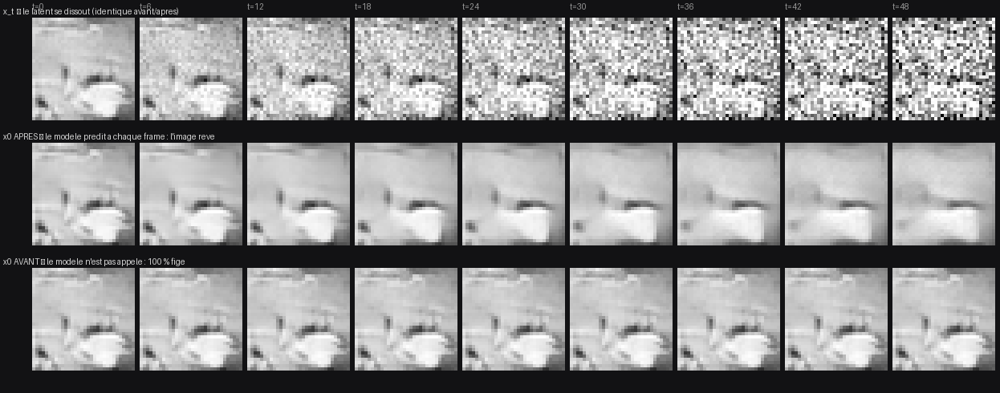
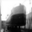
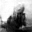
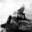

# IMG2IMG_DRIFT — la dérive part d'une image, et ne se fige plus

Mission `img2img-drift`. Deux évolutions issues de l'usage réel : une petite
(l'aide au choix du modèle montre l'architecture) et une refonte artistique du
mode Perpetual, qui cesse d'être une génération qui erre pour devenir une
**dérive img2img continue**.

Le retour utilisateur, mot pour mot :

> le mieux, c'est de partir d'une image déjà réelle, jauger le niveau de bruit
> qu'on réinjecte, refaire prédire le modèle, itérer, et laisser le modèle
> drifter. On n'a même pas besoin de la fenêtre de gauche. Et il y a toujours un
> moment où, pendant qu'on réinjecte le bruit, ça se met en pause — ce n'est pas
> l'effet voulu.

Quatre phrases, quatre changements. Le troisième — « ça se met en pause » — a une
cause racine mesurable, et c'est le cœur du rapport.

---

## 1. La cause racine du « pause », confirmée

### Ce que c'était

La remontée (`climb`) d'un cycle d'errance ou de respiration est **arithmétique
pure** : `LinearNoiseSchedule::forward_from` porte le latent du départ vers le
niveau visé, un champ tiré une fois par cycle et révélé progressivement à mesure
que son amplitude monte (c'est le fix de `CLIMB_COHERENCE.md`, qui empêche la
montée de crépiter). **Le modèle n'était pas appelé du tout pendant ce temps.**

Le code le disait, d'ailleurs, en toutes lettres :

```rust
// x̂₀ stays put: the model is not predicting during the climb, and inventing
// a right-hand pane would be a lie.
live.publish(&latent, &last_x0);
```

Ce n'était pas une invention : c'était une décision, prise quand la fenêtre
montrait deux panneaux et que le panneau de gauche (x_t, qui se dissout
visiblement) portait l'information. Mais l'utilisateur regarde le panneau de
droite. Et ce panneau tenait, pendant `t_r + 1` frames consécutives, **la même
image, au bit près** — celle que la descente avait laissée. Puis il sautait.

Le compteur avançait, la phase affichait « remontée », le latent bougeait. Rien
n'était bloqué. C'est exactement pourquoi ça n'avait pas été trouvé plus tôt.

### La mesure

Dump `--dump` (les deux panneaux en f32 brut, jamais en PNG : `CLIMB_COHERENCE.md`
§6 — les |Δ| en jeu valent moins d'un niveau 8 bits, un PNG mesurerait le
quantiseur). Modèle `Greyscale_Diffusion_L`, `night_run.ckpt`, seed 4, 800
actions, `--seed-noise` des deux côtés pour que la comparaison soit à
paramètres égaux.

| régime      | frames de remontée | figées AVANT | figées APRÈS | \|Δ\| médiane remontée APRÈS |
|-------------|-------------------:|-------------:|-------------:|-----------------------------:|
| errance     | 294                | **294 (100 %)** | **0 (0 %)** | 0,429 niveau 8 bits |
| respiration | 293                | **293 (100 %)** | **0 (0 %)** | 0,728 |
| flux        | 0 (aucune remontée)| 0            | 0            | — |

Sur la durée totale du run : **36,8 % des frames figées en errance** avant fix,
**0,8 % après** (36,7 % → 1,4 % en respiration). Un run t_r=32 sur 600 actions
donne les mêmes proportions : 179/179 → 0/179.

**Contrôle** : le régime *flux* est **bit-à-bit identique avant/après** (|Δ|
médiane 2,969 des deux côtés, 0 frame figée des deux côtés). Flux ne remonte
jamais — il n'avait donc pas le défaut, et n'a pas bougé. C'est ce qui confirme
que le fix touche la remontée et rien d'autre.

Et c'est aussi la correction d'une conclusion de `PERPETUAL_FLUX.md`, qui
attribuait au *régime* (« x̂₀ reste figé la moitié du temps avant de sauter »,
médiane 0,00 pour errance et respiration contre 3,59 pour flux) ce qui était en
fait un défaut de la **remontée**. Flux était supérieur parce qu'il était le seul
régime à ne pas remonter. Les trois sont maintenant vivants.

### Le fix

La trajectoire ne change **pas** : le latent monte toujours en forme close depuis
un départ unique sous un champ unique. Ce qui change, c'est que la remontée
**demande aussi au modèle ce qu'il voit maintenant**, à chaque frame, au niveau
où le latent se trouve réellement. Le latent suit le processus avant ; l'estimée
à côté rêve en continu.

C'est un **read** : `asking_the_model_during_the_climb_does_not_move_the_latent`
vérifie, au bit près, que chaque latent de remontée est toujours exactement
`forward_from(départ, …)`. Un read qui perturberait l'état échangerait le pause
contre une dérive qui ne tient plus son niveau de bruit.

### La planche



Une remontée complète t_r=48, neuf niveaux échantillonnés (t=0 → 48).

- **Ligne 1** — `x_t`, le latent : il se dissout dans le bruit. Identique avant
  et après, c'est le point.
- **Ligne 2** — `x̂₀` **après** : l'image se ramollit, les formes migrent, le
  contenu se réinvente à mesure que le bruit monte. Elle rêve.
- **Ligne 3** — `x̂₀` **avant** : neuf copies de la même image. Le pause, rendu
  visible.

### Le coût

Un appel modèle de plus par frame de montée. Mesuré, 800 actions, errance
t_r=48, non throttlé :

|         | appels modèle | durée | frames/s |
|---------|--------------:|------:|---------:|
| AVANT   | 506 / 800     | 1,53 s | 523 |
| APRÈS   | 800 / 800     | 2,47 s | 324 |

3,09 ms par frame contre 1,91 ms. Le tempo par défaut est de **30 pas/s** :
il reste **10,8× de marge**. Le fix est gratuit en usage, et `CLIMB_TEMPO_RATIO`
paçait déjà les deux phases à la même cadence — il pace maintenant deux frames de
coût comparable au lieu d'une gratuite et d'une chère.

### Ce qui reste : une frame par cycle, et pourquoi ce n'en est pas une

Le dernier incrément de la remontée atterrit sur `t_r`, et la descente qui suit
relit **ce même latent** à **ce même niveau** — un pas inverse dérive x̂₀ de `x_t`
*avant* de stepper. Deux frames consécutives tombent donc sur le même instant et
sont d'accord dessus. Ce n'est pas une estimée périmée : c'est le même instant lu
deux fois. **33 ms à 30 fps, contre 570 ms de gel à t_r=16.**

C'est un contrat, pas une tolérance :
`the_only_estimate_a_cycle_repeats_is_the_one_at_its_turn` exige que toute
répétition soit une descente suivant immédiatement une remontée, et qu'il y en
ait au plus une par cycle fermé. Une répétition ailleurs est une régression.
Flux, qui n'a pas de tournant, n'a pas droit à l'exception non plus
(`the_flux_churn_never_shows_the_same_estimate_twice_running`).

---

## 2. La dérive part d'une vraie image

`PerpetualOrigin::{Noise, Image}`. Un run seedé sur une photo démarre là où un
cycle d'errance *finit* : un `x₀` propre à `t = 0`, sur le point de remonter.

**Aucune phase nouvelle n'a été ajoutée.** `PerpetualDrift::from_image` ouvre
exactement l'état que laisse `open_climb` — le même chemin qu'un cycle qui vient
de se résoudre, entré depuis l'extérieur. Conséquence directe : le cadran de
bruit travaille **dès la frame 1**, au lieu d'après 256 pas de descente. « Jauger
le niveau de bruit qu'on réinjecte » est immédiat.

- `[r]` re-tire une **autre** image du dataset. L'origine est conservée à travers
  le re-seed : repartir en bruit pur sur une frappe changerait ce qu'est la
  pièce, et le caller — qui lit `origin()` pour décider quoi tirer — remettrait
  un latent du mauvais genre dans une dérive déjà en train de monter.
- Le dataset est résolu par `--seed-dataset`, sinon `seed_dataset` du
  `config_file`, sinon **dérivé des canaux de sortie du modèle** (1 →
  `cifar10_grey.batraw`, 3 → `cifar10_rgb.batraw`). Le deviner serait pire que
  l'ignorer : `try_load_raw_dataset` redimensionne sans broncher, donc un modèle
  gris nourri au fichier RGB dériverait d'une image massacrée, sans une erreur.
- **Introuvable → repli sur le bruit pur**, annoncé à l'écran et dans le panneau
  (`origine : bruit pur (aucun dataset)`). Un dataset **nommé** et manquant est
  en revanche une erreur : se rabattre en silence ressemblerait exactement au
  flag ignoré.

**Une seule fonction fournit l'image** — `SeedImages::provide_x0`. Ajouter un
sélecteur (un index tapé dans le formulaire, un fichier déposé) est un second
constructeur à côté de `at_random`, pas un nouveau site d'appel : les deux
chemins perpetual n'appellent que `provide_x0`.

L'index est **avalanché** depuis la graine, jamais `seed % len`. Les graines
viennent d'une horloge (`random_seed`) ou d'un formulaire ; le modulo ferait
défiler le dataset dans l'ordre à chaque `[r]` et corrélerait le run avec l'ordre
du fichier. Même discipline que `gaussian_at` — mélanger d'abord, indexer
ensuite (`ANISOTROPY_HUNT.md`).

**Vérifié hors du code** : le `000.png` d'un run headless est l'image **7535** de
`cifar10_grey.batraw`, comparée en Python depuis les octets du dataset —
**écart maximum 0 niveau 8 bits**.





---

## 3. La fenêtre : x̂₀ seul par défaut

`LiveView::{X0Only, Both}`. Le défaut en perpetual est **x̂₀ seul**, carré, au
vrai ratio de l'image. `[x]` rebascule sur la double vue `x_t | x̂₀`.

La raison n'est pas la place à l'écran : *« on n'a même pas besoin de la fenêtre
de gauche »*. Une dérive est faite pour être **regardée**, et la double vue met
l'image dans une moitié de fenêtre au mauvais ratio, à côté d'un champ de bruit
qui lui dispute l'attention. Le bruit est diagnostique — il reste à une touche.

La vue simple est aussi la seule dont la frame est **carrée**, c'est-à-dire la
géométrie réelle d'un échantillon CIFAR. Rien n'a été touché dans le visualiseur :
il letterboxe déjà ce qu'on lui donne, donc la fenêtre s'ouvre juste — 32×32 →
544×544 (×17, le plus grand multiple entier qui tienne dans la cible), pinné par
`the_single_pane_frame_opens_square`.

Basculer réalloue la frame (le buffer est dimensionné pour la vue) et
ré-inscrit la source : la fenêtre revient au nouveau ratio, repeinte
immédiatement depuis ce qui est déjà en main, jamais sur une frame de gris.

**L'inférence normale ne bouge pas** : `--headless-sample` et le sampling
classique gardent la double vue (`LiveView::default() == Both`, pinné).

---

## 4. L'aide au choix du modèle affiche l'architecture

Sur l'écran d'accueil, le panneau de droite (celui de `UX_NAV.md` item 4) décrit
maintenant le modèle sous le curseur : géométrie, nombre de couches, paramètres,
champ réceptif **avec son verdict**, couches notables, puis la pile entière.

Le fait qui vaut le panneau à lui seul : **« champ réceptif 13/32 px — NE COUVRE
PAS »**. Les deux templates livrent une pile dont un pixel de sortie ne voit
qu'un carré de 13 px sur une image de 32 : il ne peut donc pas choisir un contenu
*global*, et la sortie est tirée vers la moyenne du dataset. Le nombre seul ne
dit rien ; c'est le verdict qui informe, et il est en jaune.

`summarize_architecture` lit le `config_file` seul — pas de GPU, pas de
checkpoint, pas de disque — d'où son coût nul à chaque frappe.

- Le **champ réceptif** suit exactement la récurrence de
  `tools/receptive_field.py` (`Concat` sauté des deux côtés : le skip réinjecté a
  un champ plus petit, la borne reste le chemin principal). L'outil Python sert
  d'oracle tiers : sur `Greyscale_Diffusion_L` il dit 35 px, le panneau affiche
  35 px. Une pile sans convolution rend `None`, pas `1` — « un pixel de
  contexte » serait une affirmation là où la question n'a pas de sens.
- Le **compte de paramètres** est croisé avec les vrais buffers d'un modèle
  construit : un checkpoint contient exactement les scalaires entraînables, donc
  `the_parameter_count_matches_the_scalars_a_checkpoint_holds` est un oracle
  indépendant, pas la même arithmétique écrite deux fois. C'est ce qui attrape un
  vecteur de biais oublié — sinon chaque modèle de la liste serait sous-compté
  sans que rien à l'écran ne le dise.
- **Rien ne dépasse la gouttière.** Ratatui ne renvoie pas à la ligne un
  `Paragraph` simple : une ligne trop longue est coupée au bord *sans marque*.
  Tout passe par `clip`, qui coupe en `chars` (les marques `✳ ↑ ⊕` sont
  multi-octets — en trancher une paniquerait le TUI) et finit par `…`. Le verdict
  a été raccourci en « 13/32 px » pour que « NE COUVRE PAS » survive aux 42
  colonnes utiles : clippé en « NE COUVRE … », il aurait dit le contraire.
- Une pile trop haute est **élidée**, pas tronquée, et l'élision dit combien de
  couches elle avale. Tête et queue gardées : la première conv dit ce qu'on
  consomme, la dernière ce qu'on émet.

---

## 5. Architecture — ce qui a bougé de place

Le pas à pas des tenseurs quitte `main.rs` pour le moteur.

- **`batlab-core/src/model/training/drift.rs`** — `DriftWalk` porte le latent et
  le départ de la remontée ; `perpetual.rs` garde l'itinéraire seul (« où sur le
  schedule »), le marcheur répond « que contiennent les deux panneaux ».
- Le couplage au réseau tient en **une question** : `NoisePredictor` — « quel
  bruit vois-tu dans ce latent, à ce niveau ? ». C'est ce qui rend le régime
  testable **sans GPU**, contre un oracle en forme close.
- **Les deux chemins perpetual** (TUI et headless) passent par le même marcheur
  et le même adaptateur `ModelNoise`. Ils ne peuvent plus diverger — et ~180
  lignes dupliquées entre eux ont disparu.
- `reverse_step` se scinde en `predict_epsilon` + `reverse_step_from_epsilon`.
  **La récursion inverse reste écrite une seule fois** : le marcheur l'appelle,
  il ne la réécrit pas.

### Le piège de l'oracle, à ne pas réintroduire

L'oracle *exact* — ε̂ optimal pour une distribution en masse de Dirac, celui que
`the_flux_churn_holds_the_law_of_its_level` utilise — est **inutilisable pour
tester le pause**. Repassé dans `x0_estimate`, il inverse `x_t` exactement :
x̂₀ sort constant, égal à `x₀`, quel que soit le latent. Un marcheur qui
n'appellerait jamais le modèle passerait le test.

L'oracle des tests de `drift.rs` est donc délibérément **sous-confiant** (×0,9),
ce qui donne ce que donne un vrai réseau :
`x̂₀ = 0,1·x_t/√ᾱ + 0,9·x₀`, une estimée qui suit réellement le latent dont elle
est tirée. Quiconque « corrige » cette constante en 1,0 rendra les tests verts et
aveugles.

---

## 6. Contrat observable (pour un test aveugle)

Ce qu'un agent aveugle peut vérifier sans lire l'implémentation.

**Le départ**

1. Un run perpetual dont le dataset est trouvable **part d'une image du dataset**,
   au bit près : le premier PNG écrit par `--headless-perpetual` (`000.png`) est
   l'un des échantillons du `.batraw`, pixel pour pixel.
2. Sans dataset (`--seed-noise`, ou dataset introuvable), il part de bruit pur en
   haut du schedule et **le dit** sur sa bannière.
3. `--seed-dataset <chemin inexistant>` est une **erreur**, pas un repli.
4. Deux graines différentes tirent (en général) deux images différentes, et des
   graines **consécutives** ne tirent pas des images consécutives.
5. Le dataset par défaut suit les canaux de **sortie** du modèle : 1 → grey,
   3 → rgb, autre → pas de défaut.

**La remontée**

6. Dans un dump `--dump` d'un run errance ou respiration, **aucune** frame
   étiquetée `remontée` (tag 1) n'a un x̂₀ identique à la frame précédente.
7. Les seules frames dont le x̂₀ répète le précédent sont des frames `descente`
   (tag 0) suivant immédiatement une `remontée`, au plus une par cycle fermé.
8. Le régime `flux` n'a **aucune** répétition.
9. Le latent (`x_t`) d'une frame de remontée est exactement
   `forward_from(départ, niveau_départ, niveau, champ_du_cycle)` — la trajectoire
   n'a pas bougé.
10. Le nombre d'appels modèle rapporté en fin de run headless **égale** le nombre
    d'actions, dans tous les régimes.

**La fenêtre**

11. En perpetual, la frame publiée par défaut fait `W` de large (pas `2W+3`), et
    ne contient **pas** le filet séparateur `[+1, −1, +1]`.
12. `[x]` bascule, et rebascule : c'est un aller-retour.
13. L'inférence classique garde la double vue.

**L'architecture**

14. Pour chaque `Models/*/config_file`, le champ réceptif affiché égale celui que
    calcule `tools/receptive_field.py`.
15. Le nombre de paramètres affiché égale le nombre de scalaires que contient un
    checkpoint du même modèle.
16. Aucune ligne du panneau ne dépasse sa colonne ; une pile élidée annonce le
    nombre de couches masquées, et tête + queue + masquées = total.

---

## 7. Parcours e2e déroulés

`BATLAB_ROOT` jetable (`Models/` recopiés, `cifar10_grey.batraw` en lien), vrai
TUI piloté par `tmux send-keys`.

**Liste des modèles** — panneau d'architecture à droite, il suit le curseur ;
`Greyscale_Diffusion_L` annonce « 32×32×5 · 28 couches · 464 k paramètres · champ
réceptif 35/32 px — couvre · ↑ 2 upsample ⊕ 2 skip » et la pile complète. Sur la
ligne « New model » le panneau disparaît et la liste reprend toute la largeur. À
100 colonnes de terminal le panneau tombe, à 112 il revient. Sur
`Color_Diffusion_L` dans un panneau de 20 lignes : 8 couches en tête, « … 12
couches … », 8 en queue.

**Perpetual** — `Greyscale_Diffusion_L` → Perpetual → `night_run.ckpt` → t_r
mis à 32 → Entrée. Le moniteur affiche :

```
  regime                errance             [m]
  phase                 descente
  niveau t_r            32 / 255            [↑ / ↓]
  cycle                 2                   [r] re-seed
  appels modèle         189
  pace                  29.7 / 30 steps/s   [← / →]
  origine               image du dataset
  fenêtre [v]           x̂₀ seul            [x]
```

`[v]` ouvre la fenêtre. `[x]` : `x̂₀ seul` → `x_t | x̂₀` → `x̂₀ seul`, aller-retour
confirmé au panneau. `[r]` : le compteur de cycles retombe à 0, une autre image
est tirée. Deux cycles atteints en ~190 appels là où un run seedé au bruit en
demande 256 rien que pour sa descente d'ouverture.

**Headless** — `--seed-noise`, `--seed-dataset`, `--single-view` déroulés ;
bannière relue à chaque fois (`bench/optimizer/lib.sh:assert_flag` en fait une
règle).

---

## 8. Flags headless (mis à jour)

```
--headless-perpetual <model> [--checkpoint P] [--regime wander|breathe|flux]
    [--t-r N | --t-star N | --depth N] [--seed N] [--magnitude F]
    [--frames N | --actions N] [--climb-frames N] [--dump P] [--out D]
    [--seed-dataset P] [--seed-noise] [--window] [--single-view]
```

- `--seed-dataset <path>` — le `.batraw` d'où tirer l'image de départ. Manquant →
  **erreur**.
- `--seed-noise` — l'ancienne ouverture (bruit pur en haut du schedule). Le seul
  moyen de rejouer une campagne d'avant l'img2img.
- `--single-view` — `--window` compose alors la vue que le TUI montre par défaut
  (x̂₀ seul, carré) au lieu de la double vue.

Note : `N actions` rend maintenant `N appels modèle` dans tous les régimes ; la
bannière imprime les deux, pour qu'un run où ils divergeraient à nouveau se voie
d'un coup d'œil.

---

## 9. Ce qui n'a pas été fait

- **Le choix manuel de l'image de départ.** Demandé « pour plus tard ». Le code
  est structuré pour : un second constructeur à côté de `SeedImages::at_random`,
  et rien d'autre à toucher.
- **La capture d'écran de la fenêtre.** Le visualiseur est une fenêtre
  *accessory* qui ne prend délibérément jamais le focus
  (`with_activate_ignoring_other_apps(false)`, `UX_NAV.md`) : `screencapture` ne
  la voit pas au premier plan et `System Events` ne l'énumère pas. La géométrie
  est donc vérifiée par test (`the_single_pane_frame_opens_square`) et par le
  composeur headless (`--window --single-view`), et le pilotage de `[x]` par le
  panneau du moniteur. La fenêtre elle-même n'a pas été photographiée.
- **Le garde-fou inter-processus** du manager reste non résolu (`UX_NAV.md`,
  `MODEL_MANAGER.md`) — hors mission.
